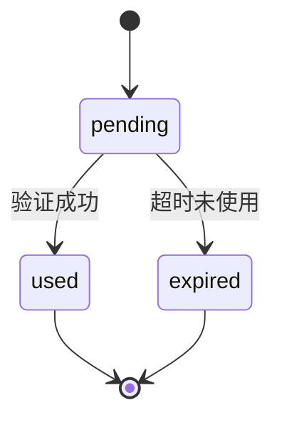
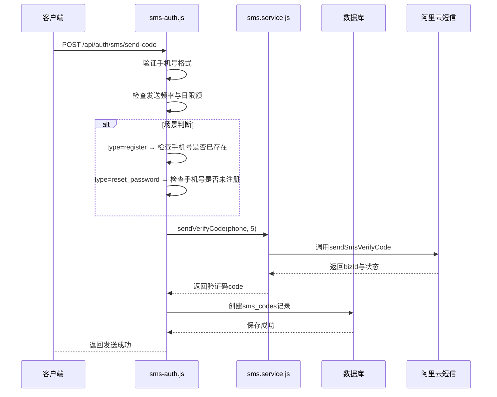
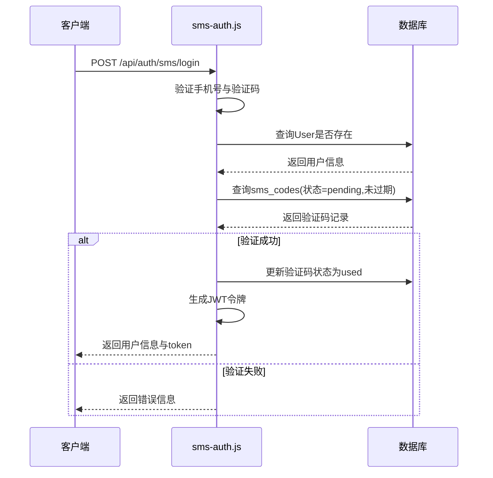

# 短信验证码表 (sms_codes)

> **本文档引用的文件**
> - [SmsCode.js](file://server/models/SmsCode.js)
> - [sms.service.js](file://server/services/sms.service.js)
> - [sms-auth.js](file://server/routes/sms-auth.js)
> - [create-sms-table.js](file://server/scripts/create-sms-table.js)

## 目录
1. [简介](#简介)
2. [表结构与字段说明](#表结构与字段说明)
3. [验证码生成与安全规则](#验证码生成与安全规则)
4. [多场景支持机制](#多场景支持机制)
5. [防重放攻击与状态管理](#防重放攻击与状态管理)
6. [与阿里云短信服务的集成](#与阿里云短信服务的集成)
7. [发送与验证流程分析](#发送与验证流程分析)
8. [安全限制与频率控制](#安全限制与频率控制)
9. [总结](#总结)

## 简介
本系统通过 `sms_codes` 表实现基于短信验证码的身份认证机制，支持登录、注册和密码重置三大核心场景。该机制结合数据库持久化、后端服务逻辑与阿里云短信平台，确保用户操作的安全性与可靠性。整个流程涵盖验证码生成、发送、验证及状态追踪，具备防刷、防重放、时效控制等多重安全策略。

## 表结构与字段说明
`sms_codes` 表用于存储每次短信验证码的发送记录，其核心字段如下：

| 字段名 | 类型 | 是否为空 | 默认值 | 说明 |
|--------|------|----------|--------|------|
| id | BIGINT | 否 | 自增 | 主键 |
| phone | STRING(20) | 否 | - | 手机号 |
| code | STRING(6) | 否 | - | 验证码 |
| biz_id | STRING(100) | 是 | - | 阿里云短信业务ID |
| type | ENUM('login', 'register', 'reset_password') | 否 | login | 验证码类型 |
| status | ENUM('pending', 'used', 'expired') | 否 | pending | 状态 |
| expires_at | DATE | 否 | - | 过期时间 |
| ip_address | STRING(45) | 是 | - | 请求IP地址 |
| created_at | DATE | 否 | - | 创建时间 |
| updated_at | DATE | 否 | - | 更新时间 |

**字段说明：**
- `type` 支持三种业务场景：登录、注册、重置密码。
- `status` 标记验证码当前状态，防止重复使用。
- `expires_at` 控制验证码有效期，系统默认为5分钟。
- `ip_address` 记录请求来源IP，用于风控与审计。
- `biz_id` 存储阿里云返回的短信唯一标识，便于后续追踪。

**表来源**
- [SmsCode.js](file://server/models/SmsCode.js#L4-L70)
- [create-sms-table.js](file://server/scripts/create-sms-table.js#L6-L6)

## 验证码生成与安全规则
系统采用安全的验证码生成机制，确保每次发送的验证码具有高随机性和不可预测性。

### 生成规则
验证码为6位纯数字，由 `crypto.randomInt` 密码学安全随机数生成：
```js
const code = crypto.randomInt(100000, 999999).toString();
```
使用 Node.js 内置 `crypto.randomInt()` 替代 `Math.random()`，生成密码学安全的随机数，消除验证码可预测风险。

### 有效期控制
验证码默认有效期为 **5分钟**，系统在创建记录时自动计算 `expires_at` 字段：
```js
const expiresAt = new Date(Date.now() + 5 * 60 * 1000);
```
在验证阶段，系统会检查当前时间是否早于 `expires_at`，否则判定为过期。

### 尝试次数限制
虽然表中未直接记录尝试次数，但系统通过 `status` 字段实现逻辑上的“一次性使用”机制：
- 每个验证码仅可成功验证一次。
- 验证成功后立即更新 `status` 为 `used`，后续请求将被拒绝。
- 结合前端限制与后端校验，有效防止暴力破解。

**代码来源**
- [sms.service.js](file://server/services/sms.service.js#L39-L41)
- [sms-auth.js](file://server/routes/sms-auth.js#L130-L135)

## 多场景支持机制
系统通过 `type` 字段实现多业务场景的统一管理，支持三种验证码用途：

| 类型 | 场景 | 说明 |
|------|------|------|
| login | 登录 | 用于用户登录验证 |
| register | 注册 | 用于新用户注册 |
| reset_password | 重置密码 | 用于找回密码流程 |

### 场景差异化处理
- **注册场景**：发送前检查手机号是否已存在，若存在则拒绝发送。
- **重置密码场景**：发送前检查手机号是否已注册，未注册则拒绝发送。
- **登录场景**：支持“登录即注册”模式，若用户不存在可直接注册。

> 注意：注册与登录共用 `login` 类型验证码，以支持“一键注册登录”功能。

**代码来源**
- [sms-auth.js](file://server/routes/sms-auth.js#L94-L114)

## 防重放攻击与状态管理
为防止验证码被重复使用或重放攻击，系统采用状态机机制进行严格管控。

### 状态流转


### 防重放实现
- 每次验证时，系统查询 `status = 'pending'` 且未过期的记录。
- 验证成功后立即执行 `update({ status: 'used' })`，标记为已使用。
- 后续任何对该验证码的验证请求均会失败。

此机制确保每个验证码只能被成功使用一次，有效防止中间人攻击与重放风险。

**Diagram sources**
- [SmsCode.js](file://server/models/SmsCode.js#L28-L38)
- [sms-auth.js](file://server/routes/sms-auth.js#L228-L229)

**Section sources**
- [SmsCode.js](file://server/models/SmsCode.js#L28-L38)
- [sms-auth.js](file://server/routes/sms-auth.js#L207-L229)

## 与阿里云短信服务的集成
系统通过官方SDK与阿里云短信服务（Dysmsapi）深度集成，确保短信发送的稳定性与合规性。

### 配置信息
| 配置项 | 来源 | 说明 |
|--------|------|------|
| accessKeyId | 环境变量 ALIYUN_ACCESS_KEY_ID | 阿里云访问密钥ID |
| accessKeySecret | 环境变量 ALIYUN_ACCESS_KEY_SECRET | 阿里云访问密钥密钥 |
| signName | 环境变量 ALIYUN_SMS_SIGN_NAME | 短信签名名称 |
| templateCode | 环境变量 ALIYUN_SMS_TEMPLATE_CODE | 短信模板CODE |

### 发送流程
1. 创建阿里云客户端（单例模式）
2. 调用 `sendSmsVerifyCode` 接口发送短信
3. 接收响应并提取 `bizId` 与发送状态
4. 将验证码与元数据持久化至 `sms_codes` 表

### 响应处理
系统对阿里云返回结果进行结构化解析：
- 成功条件：`success === true` 且 `code === 'OK'`
- 失败时记录错误信息并返回用户友好提示

**代码来源**
- [sms.service.js](file://server/services/sms.service.js#L10-L33)
- [sms-auth.js](file://server/routes/sms-auth.js#L122-L123)

## 发送与验证流程分析
系统通过 `sms-auth.js` 路由模块提供完整的短信认证接口，涵盖发送、登录、注册、重置密码等操作。

### 发送验证码流程


**Diagram sources**
- [sms-auth.js](file://server/routes/sms-auth.js#L26-L163)
- [sms.service.js](file://server/services/sms.service.js#L49-L112)

### 验证码验证流程（以登录为例）


**Diagram sources**
- [sms-auth.js](file://server/routes/sms-auth.js#L169-L269)

## 安全限制与频率控制
为防止恶意刷短信，系统实施多层防护策略：

### 1. 发送频率限制
- 同一手机号 **60秒内不可重复发送**
- 超出限制返回 `429 Too Many Requests`

```js
const recentCode = await SmsCode.findOne({
  where: {
    phone,
    created_at: { [Op.gte]: new Date(Date.now() - 60 * 1000) }
  }
});
```

### 2. 每日发送上限
- 同一手机号 **每日最多发送10次**
- 超出限制提示“今日发送次数已达上限”

```js
const todayCount = await SmsCode.count({
  where: {
    phone,
    created_at: { [Op.gte]: todayStart }
  }
});
```

### 3. IP地址记录
- 记录每次发送请求的 `ip_address`
- 可用于后续风控分析与异常行为追踪

**代码来源**
- [sms-auth.js](file://server/routes/sms-auth.js#L53-L73)
- [sms-auth.js](file://server/routes/sms-auth.js#L75-L87)

## 总结
`sms_codes` 表及其配套服务构成了本系统安全认证的核心基础设施。通过合理的表结构设计、严格的验证流程、多场景支持与多层次安全控制，系统实现了高效、安全、可靠的短信认证机制。结合阿里云短信平台，确保了消息送达的稳定性与合规性。整体设计兼顾用户体验与系统安全，适用于医疗类应用对身份认证的高标准要求。