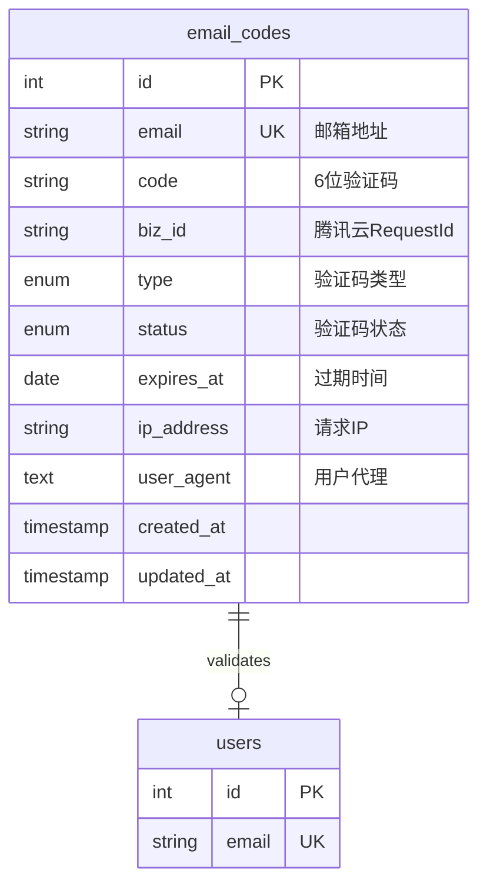
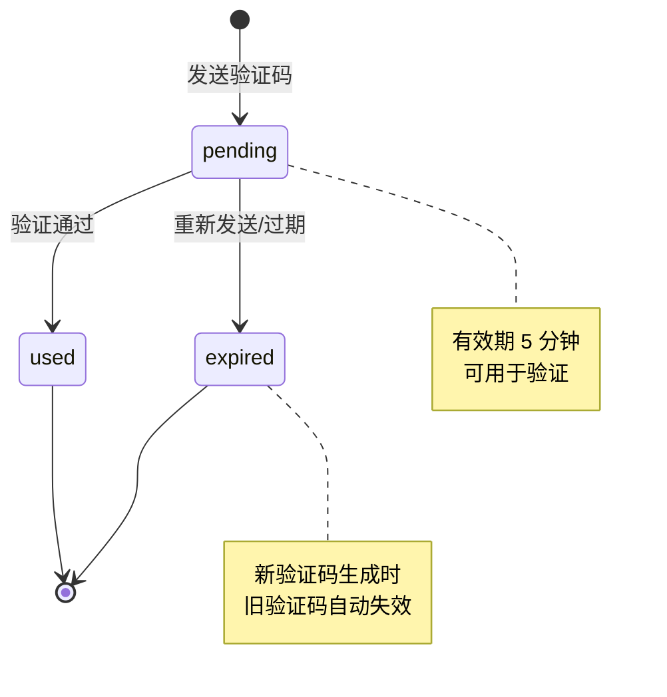

# 邮箱验证码表 (email_codes)

> **本文档引用的文件**
> - [EmailCode.js](../../server/models/EmailCode.js)
> - [email-auth.js](../../server/routes/email-auth.js)

## 目录
1. [表概述](#表概述)
2. [表结构](#表结构)
3. [字段说明](#字段说明)
4. [索引设计](#索引设计)
5. [模型方法](#模型方法)
6. [数据生命周期](#数据生命周期)
7. [查询示例](#查询示例)

## 表概述

`email_codes` 表用于存储邮箱验证码的发送记录和状态信息。每次发送验证码时都会在此表中创建一条记录，用于验证用户提交的验证码是否有效。



**Diagram sources**
- [EmailCode.js](../../server/models/EmailCode.js#L1-L94)

### 表基本信息

| 属性 | 值 |
|------|-----|
| 表名 | `email_codes` |
| 存储引擎 | InnoDB |
| 字符集 | utf8mb4 |
| 排序规则 | utf8mb4_unicode_ci |
| 时间戳列 | `created_at`、`updated_at` |

---

## 表结构

### 完整 DDL

```sql
CREATE TABLE `email_codes` (
  `id` INT NOT NULL AUTO_INCREMENT PRIMARY KEY,
  `email` VARCHAR(100) NOT NULL COMMENT '邮箱地址',
  `code` VARCHAR(6) NOT NULL COMMENT '6位验证码',
  `biz_id` VARCHAR(100) NULL COMMENT '腾讯云返回的RequestId',
  `type` ENUM('register', 'reset_password') NOT NULL DEFAULT 'register' COMMENT '验证码类型',
  `status` ENUM('pending', 'used', 'expired') NOT NULL DEFAULT 'pending' COMMENT '验证码状态',
  `expires_at` DATETIME NOT NULL COMMENT '过期时间（5分钟后）',
  `ip_address` VARCHAR(45) NULL COMMENT '请求IP地址（支持IPv6）',
  `user_agent` TEXT NULL COMMENT '用户代理信息',
  `created_at` DATETIME NOT NULL,
  `updated_at` DATETIME NOT NULL,

  INDEX `idx_email` (`email`),
  INDEX `idx_email_code` (`email`, `code`),
  INDEX `idx_status` (`status`),
  INDEX `idx_expires_at` (`expires_at`),
  INDEX `idx_type` (`type`),
  INDEX `idx_created_at` (`created_at`)
) ENGINE=InnoDB DEFAULT CHARSET=utf8mb4 COLLATE=utf8mb4_unicode_ci;
```

**Section sources**
- [EmailCode.js](../../server/models/EmailCode.js#L1-L94)

---

## 字段说明

### 主键

| 字段名 | 类型 | 属性 | 说明 |
|--------|------|------|------|
| `id` | `INT` | PK, AUTO_INCREMENT | 主键，自增 ID |

### 业务字段

| 字段名 | 类型 | 必填 | 默认值 | 说明 |
|--------|------|------|--------|------|
| `email` | `VARCHAR(100)` | 是 | - | 收件人邮箱地址 |
| `code` | `VARCHAR(6)` | 是 | - | 6 位数字验证码 |
| `biz_id` | `VARCHAR(100)` | 否 | `NULL` | 腾讯云 SES 返回的 RequestId，用于追踪发送状态 |
| `type` | `ENUM` | 是 | `register` | 验证码类型：`register`（注册）、`reset_password`（重置密码） |
| `status` | `ENUM` | 是 | `pending` | 验证码状态：`pending`（待使用）、`used`（已使用）、`expired`（已过期） |
| `expires_at` | `DATETIME` | 是 | 当前时间 + 5 分钟 | 验证码过期时间 |

### 审计字段

| 字段名 | 类型 | 必填 | 默认值 | 说明 |
|--------|------|------|--------|------|
| `ip_address` | `VARCHAR(45)` | 否 | `NULL` | 请求 IP 地址，长度 45 支持 IPv6 |
| `user_agent` | `TEXT` | 否 | `NULL` | 用户代理信息，记录浏览器/设备信息 |
| `created_at` | `DATETIME` | 是 | 当前时间 | 记录创建时间 |
| `updated_at` | `DATETIME` | 是 | 当前时间 | 记录更新时间 |

**Section sources**
- [EmailCode.js](../../server/models/EmailCode.js#L4-L56)

---

## 索引设计

### 索引列表

| 索引名 | 类型 | 字段 | 用途 |
|--------|------|------|------|
| `PRIMARY` | 主键 | `id` | 主键索引 |
| `idx_email` | 普通索引 | `email` | 按邮箱查询发送记录 |
| `idx_email_code` | 联合索引 | `email`, `code` | 验证码查询（最常用） |
| `idx_status` | 普通索引 | `status` | 按状态筛选有效/已使用记录 |
| `idx_expires_at` | 普通索引 | `expires_at` | 查询未过期记录、清理过期数据 |
| `idx_type` | 普通索引 | `type` | 按类型筛选（注册/重置密码） |
| `idx_created_at` | 普通索引 | `created_at` | 按时间排序、统计发送次数 |

**Section sources**
- [EmailCode.js](../../server/models/EmailCode.js#L61-L86)

### 索引使用场景

#### 验证码验证

```sql
-- 使用 idx_email_code 索引
SELECT * FROM email_codes
WHERE email = 'user@example.com'
  AND code = '123456'
  AND type = 'register'
  AND status = 'pending'
  AND expires_at > NOW();
```

#### 频率限制检查

```sql
-- 使用 idx_email 和 idx_created_at 索引
SELECT COUNT(*) FROM email_codes
WHERE email = 'user@example.com'
  AND created_at >= '2026-02-05 00:00:00';
```

#### 清理过期数据

```sql
-- 使用 idx_expires_at 索引
DELETE FROM email_codes
WHERE expires_at < DATE_SUB(NOW(), INTERVAL 24 HOUR);
```

---

## 模型方法

### 实例方法

#### markAsUsed()

将验证码标记为已使用。

**调用示例**：
```javascript
const validCode = await EmailCode.findValidCode('user@example.com', '123456', 'register');
if (validCode) {
  await validCode.markAsUsed();
}
```

**SQL 等效**：
```sql
UPDATE email_codes
SET status = 'used', updated_at = NOW()
WHERE id = 123;
```

**Section sources**
- [EmailCode.js](../../server/models/EmailCode.js#L99-L102)

#### markAsExpired()

将验证码标记为已过期。

**调用示例**：
```javascript
await emailCode.markAsExpired();
```

**Section sources**
- [EmailCode.js](../../server/models/EmailCode.js#L104-L107)

### 静态方法

#### findValidCode(email, code, type)

查找有效的验证码记录。

**查询条件**：
- 邮箱地址匹配
- 验证码匹配
- 类型匹配
- 状态为 `pending`
- 未过期（`expires_at` > 当前时间）

**调用示例**：
```javascript
const validCode = await EmailCode.findValidCode(
  'user@example.com',
  '123456',
  'register'
);
```

**SQL 等效**：
```sql
SELECT * FROM email_codes
WHERE email = 'user@example.com'
  AND code = '123456'
  AND type = 'register'
  AND status = 'pending'
  AND expires_at > NOW()
ORDER BY created_at DESC
LIMIT 1;
```

**Section sources**
- [EmailCode.js](../../server/models/EmailCode.js#L113-L127)

#### invalidatePreviousCodes(email, type)

使该邮箱之前的同类验证码失效。

**调用示例**：
```javascript
await EmailCode.invalidatePreviousCodes('user@example.com', 'register');
```

**SQL 等效**：
```sql
UPDATE email_codes
SET status = 'expired', updated_at = NOW()
WHERE email = 'user@example.com'
  AND type = 'register'
  AND status = 'pending';
```

**Section sources**
- [EmailCode.js](../../server/models/EmailCode.js#L129-L141)

#### cleanupExpiredCodes()

清理 24 小时前的过期验证码记录（建议定时任务调用）。

**调用示例**：
```javascript
const deleted = await EmailCode.cleanupExpiredCodes();
console.log(`清理了 ${deleted} 条过期验证码记录`);
```

**SQL 等效**：
```sql
DELETE FROM email_codes
WHERE expires_at < DATE_SUB(NOW(), INTERVAL 24 HOUR);
```

**定时任务配置建议**（使用 node-cron）：
```javascript
const cron = require('node-cron');

// 每天凌晨 2 点执行清理
cron.schedule('0 2 * * *', async () => {
  const deleted = await EmailCode.cleanupExpiredCodes();
  console.log(`[EmailCode Cleanup] 清理了 ${deleted} 条记录`);
});
```

**Section sources**
- [EmailCode.js](../../server/models/EmailCode.js#L143-L154)

---

## 数据生命周期

### 状态转换图



### 生命周期事件

| 事件 | 触发条件 | 状态变化 |
|------|---------|---------|
| 创建 | 用户请求发送验证码 | - |
| 发送成功 | 腾讯云 SES 返回成功 | `status = pending` |
| 验证通过 | 用户输入正确验证码 | `status = used` |
| 自动失效 | 同一邮箱重新发送 | `status = expired` |
| 清理删除 | 定时任务执行 | 记录删除 |

**Section sources**
- [email-auth.js](../../server/routes/email-auth.js#L96-L98)

### Model Hooks

#### beforeCreate

在创建记录前自动设置过期时间为当前时间 + 5 分钟。

**实现代码**：
```javascript
hooks: {
  beforeCreate: (emailCode) => {
    emailCode.expires_at = new Date(Date.now() + 5 * 60 * 1000);
  },
}
```

**SQL 等效**：
```sql
-- 创建记录时自动计算
INSERT INTO email_codes (..., expires_at, ...)
VALUES (..., DATE_ADD(NOW(), INTERVAL 5 MINUTE), ...);
```

**Section sources**
- [EmailCode.js](../../server/models/EmailCode.js#L87-L92)

---

## 查询示例

### 查询某邮箱的所有验证码记录

```sql
SELECT
  id,
  code,
  type,
  status,
  expires_at,
  created_at
FROM email_codes
WHERE email = 'user@example.com'
ORDER BY created_at DESC;
```

### 查询今日发送次数

```sql
SELECT
  COUNT(*) AS total_count,
  SUM(CASE WHEN status = 'pending' THEN 1 ELSE 0 END) AS pending_count,
  SUM(CASE WHEN status = 'used' THEN 1 ELSE 0 END) AS used_count,
  SUM(CASE WHEN status = 'expired' THEN 1 ELSE 0 END) AS expired_count
FROM email_codes
WHERE email = 'user@example.com'
  AND DATE(created_at) = CURDATE();
```

### 查询过期未使用的验证码

```sql
SELECT
  email,
  code,
  type,
  expires_at,
  created_at
FROM email_codes
WHERE status = 'pending'
  AND expires_at < NOW()
ORDER BY expires_at DESC;
```

### 统计各类型验证码使用情况

```sql
SELECT
  type,
  status,
  COUNT(*) AS count
FROM email_codes
WHERE created_at >= DATE_SUB(NOW(), INTERVAL 7 DAY)
GROUP BY type, status
ORDER BY type, status;
```

### 查询可疑行为（高频请求）

```sql
SELECT
  email,
  COUNT(*) AS request_count,
  COUNT(DISTINCT ip_address) AS ip_count
FROM email_codes
WHERE created_at >= DATE_SUB(NOW(), INTERVAL 1 HOUR)
GROUP BY email
HAVING request_count > 5
ORDER BY request_count DESC;
```

---

## 数据维护建议

### 定期清理

建议配置定时任务每天清理过期验证码：

```javascript
// 使用 node-cron
cron.schedule('0 2 * * *', async () => {
  await EmailCode.cleanupExpiredCodes();
});
```

### 数据保留策略

- 未使用验证码：保留 24 小时后删除
- 已使用验证码：永久保留（用于审计）
- 已过期验证码：保留 24 小时后删除

---

## 相关文档

- [邮箱认证服务](../../后端架构/业务逻辑层/邮箱认证服务.md) - 邮件发送服务实现
- [邮箱验证码 API](../../API参考/认证API/邮箱验证码API.md) - API 接口文档
