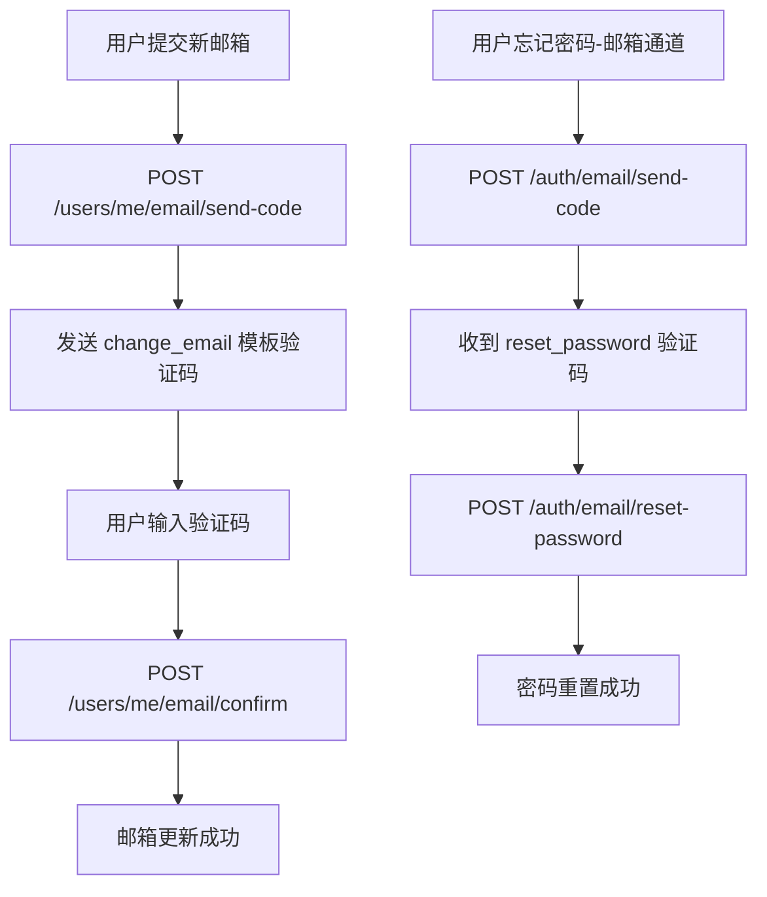

# 2026-02-23 邮件场景扩展与邮箱安全 UI 重构

本文档记录本次围绕“邮件推送场景扩展 + 邮箱安全交互统一 + 邮箱找回密码恢复”完成的增量改动。

## 更新日期

2026年2月23日

## 引用来源

> 本文内容直接依据以下代码文件同步：
>
> - `server/services/email.service.js`
> - `server/routes/email-auth.js`
> - `server/routes/users.js`
> - `server/routes/auth.js`
> - `server/services/analysisService.js`
> - `src/services/api.ts`
> - `src/components/settings/EmailSecurityCard.vue`
> - `src/pages/ProfilePage.vue`
> - `src/pages/SettingsPage.vue`
> - `src/pages/ForgotPasswordPage.vue`

---

## 一、邮件推送能力扩展

### 1.1 场景矩阵

| 场景 | 模板键 | 模板 ID | 触发入口 |
| :--- | :--- | :--- | :--- |
| 注册验证码 | `register` | `TEMPLATE_ID_REGISTER` | `POST /api/auth/email/send-code` |
| 重置密码验证码 | `reset_password` | `TEMPLATE_ID_RESET_PASSWORD` | `POST /api/auth/email/send-code` |
| 更换邮箱验证码 | `change_email` | `42475` | `POST /api/users/me/email/send-code` |
| 报告生成完成 | `report_ready` | `42476` | 分析结果落库后 |
| 注册成功欢迎 | `register_success` | `42477` | 用户注册成功后 |

### 1.2 配置策略

- 邮件模板 ID 仅从环境变量读取，不做硬编码回退。
- 模板缺失时返回明确错误，避免静默失败。

---

## 二、接口与流程变更

### 2.1 新增接口

- `POST /api/auth/email/reset-password`
  - 入参：`email`、`code`、`newPassword`
  - 行为：校验 `reset_password` 验证码并重置密码

### 2.2 既有接口增强

- `POST /api/users/me/email/send-code`
  - 继续用于更换邮箱验证码发送，依赖 `change_email` 模板
- `POST /api/users/me/email/confirm`
  - 校验验证码后更新用户邮箱

### 2.3 端到端流程图



---

## 三、前端 UI 与交互重构

### 3.1 统一邮箱安全交互

- 新增复用组件：`EmailSecurityCard.vue`
- `ProfilePage` 与 `SettingsPage` 均改为：
  - 资料表单只展示当前邮箱（只读）
  - 更换邮箱在独立“邮箱安全”卡片中完成

### 3.2 忘记密码邮箱通道恢复

- `ForgotPasswordPage` 取消邮箱通道禁用状态
- 邮箱通道支持完整改密闭环（发送码 -> 新密码 -> 确认）

### 3.3 前端调用示例

```ts
// src/services/api.ts
await authAPI.resetPasswordByEmail(email, code, newPassword);
await userAPI.sendChangeEmailCode(newEmail);
await userAPI.confirmChangeEmail(newEmail, verifyCode);
```

---

## 四、数据库与排查示例

### 4.1 验证码类型分布检查（SQL）

```sql
SELECT type, COUNT(*) AS total
FROM email_codes
GROUP BY type
ORDER BY total DESC;
```

### 4.2 最近更换邮箱验证码记录（SQL）

```sql
SELECT id, email, type, status, created_at, expires_at
FROM email_codes
WHERE type = 'change_email'
ORDER BY created_at DESC
LIMIT 20;
```

---

## 五、结果总结

- ✅ 完成 3 个新增邮件场景接入：更换邮箱验证码、报告生成完成、注册成功欢迎。
- ✅ 新增邮箱验证码重置密码接口，邮箱找回密码流程恢复可用。
- ✅ 个人资料与系统设置页面统一为独立邮箱安全卡片，交互更清晰、可维护性更高。
