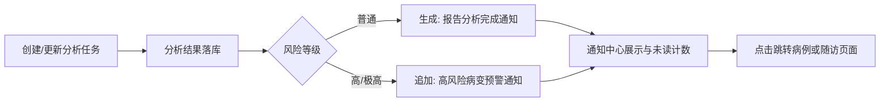

# 2026-02-23 随访管理与站内通知及UI优化

本文档记录近期围绕“随访管理 + 站内通知 + 全局 UI 视觉一致性”完成的增量改动，覆盖后端模型与任务调度、前端交互联动与样式体系统一。

## 更新日期

2026年2月23日

## 提交引用

- `752f36c` - `feat(followup): 集成随访和通知模块及前端通知面板`
- `af1dbac` - `style(ui): 统一圆角、边框、阴影及玻璃化主题变量`

---

## 一、随访管理能力落地

### 1.1 后端模块

- 新增随访模型：`server/models/FollowUp.js`
- 新增随访路由：`server/routes/followups.js`
- 新增随访提醒调度服务：`server/services/followupScheduler.service.js`
- 服务启动时接入基础设施保障与定时任务：
  - `ensureFollowUpInfrastructure()`
  - `startFollowUpScheduler()`

### 1.2 核心接口能力

- `POST /api/followups`：创建随访计划
- `GET /api/followups`：分页查询随访计划
- `PUT /api/followups/:id`：编辑随访计划
- `PATCH /api/followups/:id/complete`：完成随访
- `PATCH /api/followups/:id/cancel`：取消随访
- `PATCH /api/followups/:id/high-attention`：标记重点关注
- `POST /api/followups/:id/remind`：立即发送提醒（站内通知）

### 1.3 前端管理页面

- 新增页面：`src/pages/FollowUpsPage.vue`
- 新增路由：`/app/follow-ups`
- 支持预设模板一键创建（低/中/高风险、术后复查）
- 支持筛选、状态流转、重点关注、立即提醒与联动刷新

---

## 二、站内通知能力增强

### 2.1 通知中心与交互

- 顶栏新增通知面板（铃铛、未读计数、通知列表、全部已读）
- 页面文件：`src/layouts/MainLayout.vue`
- 通知联动跳转：
  - `related_type=study` 跳转病例详情
  - 随访类通知跳转随访管理并带查询条件

### 2.2 通知接口与后端

- 新增通知路由：`server/routes/notifications.js`
- 新增通知服务：`server/services/notificationService.js`
- 支持接口：
  - `GET /api/notifications`
  - `GET /api/notifications/unread-count`
  - `PATCH /api/notifications/:id/read`
  - `PATCH /api/notifications/read-all`

### 2.3 分析结果通知接入

- 在分析结果落库后自动推送站内通知：
  - 分析完成：`报告分析完成`
  - 高风险/极高风险：`高风险病变预警`
- 触发位置：
  - `server/services/analysisService.js`
  - `server/routes/analysis-tasks.js`

### 2.4 设置页通知渠道补充

- API 设置页新增通知渠道选项：`站内通知 (in_app)`
- 页面文件：`src/pages/ApiSettingsPage.vue`
- 默认通知渠道与重置默认值已包含 `in_app`

---

## 三、UI 视觉与主题一致性优化

### 3.1 全局设计令牌统一

- 统一圆角、边框、阴影、玻璃化变量
- 关键文件：
  - `src/css/design-tokens.scss`
  - `src/css/app.scss`

### 3.2 关键界面体验提升

- 通知面板定位、层级、圆角与明暗主题可读性优化
- 聊天面板浅色/深色主题一致性增强
- 病例详情分析区域增加玻璃层次并修正“有结果仍分析中”状态收敛逻辑

---

## 业务流程示意

---

## 功能结果汇总

- ✅ 随访管理全链路可用（模型、接口、页面、定时提醒、手动提醒）
- ✅ 站内通知中心可用（列表、计数、已读、跳转联动）
- ✅ 分析完成与高风险通知自动推送
- ✅ API 设置页支持 `in_app` 站内通知渠道
- ✅ UI 视觉统一增强（圆角/边框/阴影/玻璃化/主题一致性）
