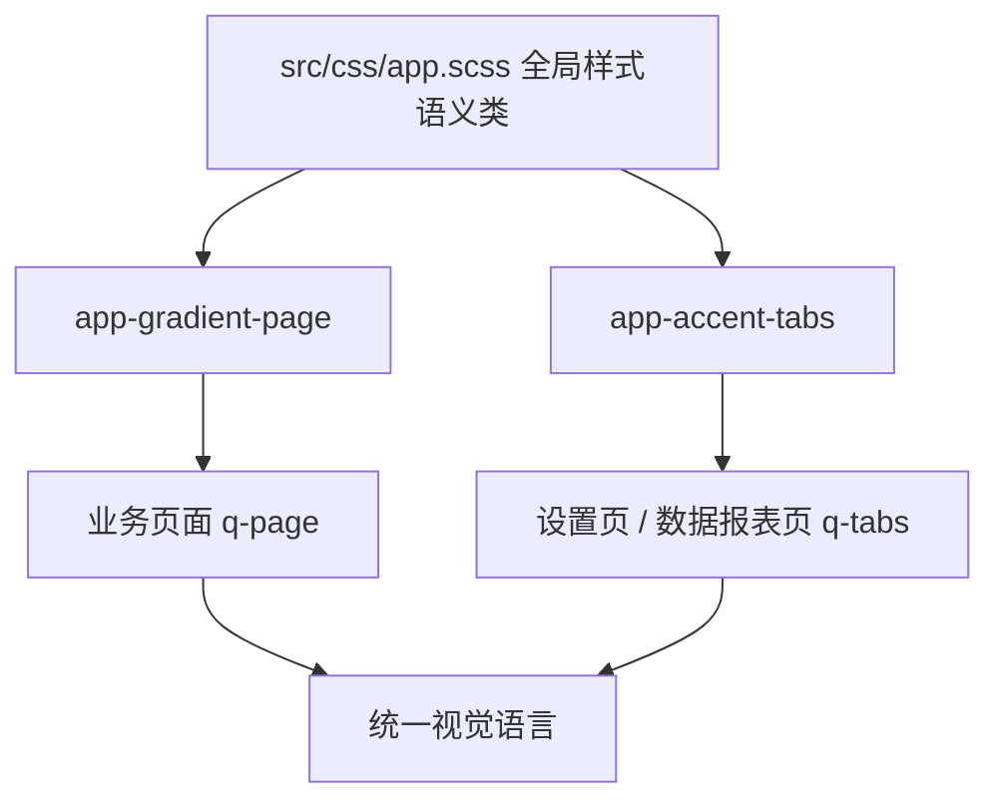

# 2026-03-01 患者洞察完善与全站视觉统一

本文档记录本轮围绕“患者洞察稳定性 + 设置页可演示性 + 跨页面视觉一致性”完成的增量改动，并同步路线图状态调整依据。

## 更新日期

2026年3月1日

## 变更来源

- 当前工作区增量改动（未提交）：
  - `src/stores/patientInsightsStore.ts`
  - `server/services/patientInsights.service.js`
  - `src/pages/PatientInsightsPage.vue`
  - `src/pages/SettingsPage.vue`
  - `src/css/app.scss`
  - `src/pages/DashboardPage.vue`
  - `src/pages/StudiesPage.vue`
  - `src/pages/StudyDetailPage.vue`
  - `src/pages/UploadPage.vue`
  - `src/pages/PatientsPage.vue`
  - `src/pages/FollowUpsPage.vue`
  - `src/pages/ReportsPage.vue`
  - `src/pages/ApiSettingsPage.vue`
  - `src/pages/ProfilePage.vue`
  - `docs/roadmap.md`

---

## 一、患者洞察中心（F2/F8/F9）从“骨架”进入“可演示”

### 1.1 历史趋势窗口口径修正

- 历史数据改为“先取最新 N 条（按 DESC + limit）再时间升序重排”。
- 目标是保证趋势、最新风险等级和最近分析时间基于最新窗口，而不是被早期数据污染。

### 1.2 切换患者时防止旧请求覆盖新状态

- `patientInsightsStore` 引入请求序列与请求令牌校验。
- 在 `overview/history/compare/timeline/riskProfile` 写入前统一校验 `isActiveRequest(...)`，避免慢请求回包覆盖当前患者页面。

### 1.3 页面可读性增强

- 时间线支持关键事件/全部事件切换、分页与筛选。
- 历史与对比区域统一使用“第 N 次检查”展示，隐藏过长内部编号对最终用户的干扰。
- 风险画像仪表盘启用圆角进度风格并保留因子明细。

---

## 二、设置页重构为系统控制台

### 2.1 信息结构升级

- 新增“系统运行概览”头部卡片与关键状态摘要。
- 参数面板与备份中心采用更大圆角和统一头部风格，分区层次更清晰。

### 2.2 交互反馈增强

- 模型操作、参数保存/重置、备份动作、软件信息入口增加 loading 态与通知反馈。
- 系统日志支持：
  - 类型筛选（账户/模型/备份/安全/系统）
  - 关键词搜索
  - 时间轴样式展示
  - 按当前筛选结果导出

### 2.3 表单体验修正

- 姓名/邮箱/手机号改为“外置标签 + 统一高度字段”布局。
- 修复输入框内标签与内容拥挤重叠问题，提升可读性与演示观感。

---

## 三、全站视觉统一（业务页）

### 3.1 新增全局样式语义类

- `app-gradient-page`：统一业务页渐变背景。
- `app-accent-tabs`：统一蓝色圆角 Tab 与激活强调色（含深色模式覆盖）。

### 3.2 应用范围

- 已覆盖 Dashboard、病例中心、病例详情、上传、患者、患者洞察、随访、报告、API 设置、系统设置、个人资料等核心业务页面。
- `SettingsPage` 与 `StudiesPage` 的 Tab 已同步使用同一套强调样式。

---

## 四、结构关系示意



---

## 五、关键代码片段

```scss
/* 全局语义样式：页面背景与Tab强调 */
.app-gradient-page {
  background:
    radial-gradient(circle at 6% 4%, rgba(59, 130, 246, 0.1), transparent 32%),
    radial-gradient(circle at 92% 2%, rgba(16, 185, 129, 0.1), transparent 28%),
    var(--app-page-bg, #f8fafc);
}

.app-accent-tabs .q-tab--active {
  background: rgba(37, 99, 235, 0.12);
  color: #1d4ed8;
}
```

```ts
// store 写入防覆盖：响应必须仍对应当前患者和当前请求
isActiveRequest(key, token, patientId) {
  return this.currentPatientId === patientId && this.requestTokens[key] === token;
}
```

---

## 六、结果总结

- ✅ F2/F8/F9 已具备完整演示链路，且修复了趋势窗口与异步覆盖两个关键一致性问题。
- ✅ 设置页从“配置集合”升级为“可演示控制台”，具备更清晰信息架构与反馈闭环。
- ✅ 业务页完成渐变背景 + 蓝色圆角 Tab 的统一视觉收敛。
- ✅ `docs/roadmap.md` 已同步状态，相关任务从“待实现”调整为“验收优化”。

