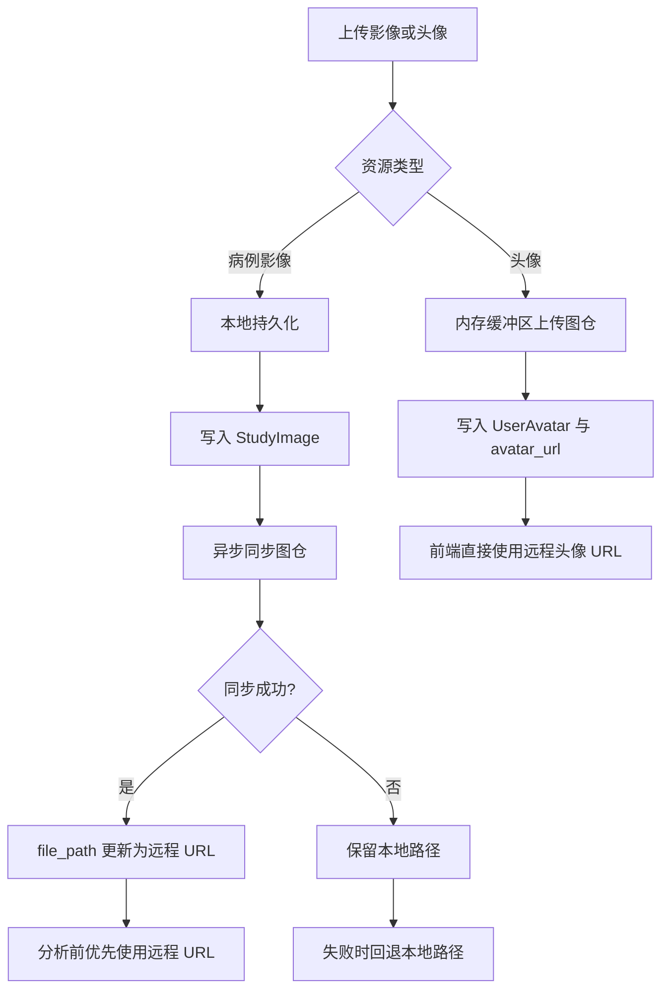

# 2026-03-03 影像存储链路重构与图仓集成

本文档记录本轮围绕“病例影像持久化、图仓远程存储、头像上传链路、分析前路径准备”完成的两阶段重构，覆盖 2026-03-03 与 2026-03-08 的连续提交。

## 更新日期

2026年3月3日

## 提交与变更来源

- `70e9d3d` - `refactor(storage): 优化影像文件存储与处理逻辑`
- `cb63cc7` - `refactor(storage): 优化影像与头像上传及同步逻辑`

> **本文档引用文件**
>
> - `server/services/tucang.service.js`
> - `server/services/studyImageStorage.service.js`
> - `server/routes/studies.js`
> - `server/routes/analyze.js`
> - `server/routes/analysis-tasks.js`
> - `server/routes/users.js`
> - `server/services/qwenService.js`

---

## 一、病例影像存储从“路由直写”改为“服务统一接管”

### 1.1 统一的影像存储服务

- 新增 `studyImageStorage.service.js`，集中处理：
  - 上传文件内容解析
  - 本地持久化
  - 图仓同步
  - 响应序列化
  - 分析前路径准备
- 路由层不再直接拼接文件路径或散落处理删除逻辑，职责更清晰。

### 1.2 本地持久化仍保留

- 病例影像上传时，仍会优先将文件写入 `server/uploads/studies`。
- 数据库中的 `file_path` 初始值为本地相对路径。
- 同步图仓失败时不会回滚主上传成功结果，便于保底可用。

---

## 二、图仓集成落地

### 2.1 图仓服务能力

- 新增 `tucang.service.js`，统一封装：
  - `TUCANG_TOKEN` 校验
  - 基础 URL 规范化
  - 超时控制
  - 可重试错误识别
  - TLS 证书链校验开关
- 支持缓冲区上传，不要求先落本地再读回内存。

### 2.2 病例影像异步同步

- `POST /api/studies/:id/images`
  - 主事务只负责本地持久化与数据库记录写入
  - 提交后异步调用 `syncStudyImageToTucang(...)`
  - 图仓同步失败时仅记录警告，保留本地路径
- `POST /api/analysis-tasks/batch`
  - 每张图片各自事务处理
  - 批量返回仍支持“部分成功”
  - 图仓同步失败不影响该条任务已创建结果

---

## 三、分析阶段支持远程 URL 优先

### 3.1 分析前路径准备

- `prepareStudyImageForAnalysis(...)` 的执行顺序：
  1. 若 `file_path` 已是远程 URL，直接使用
  2. 否则先尝试同步图仓
  3. 若同步失败，再回退本地绝对路径

### 3.2 通义千问服务兼容双路径

- `qwenService.js` 增加 `isHttpUrl(...)`
- 当输入是远程 URL 时，直接作为 `image_url` 发送给模型
- 仅当输入是本地文件时，才执行 Base64 转换

---

## 四、头像上传链路更新

### 4.1 头像上传改为图仓直传

- `POST /api/users/me/avatar` 使用 `multer.memoryStorage()`
- 上传内容直接通过 `uploadBufferToTucang(...)` 发送至图仓
- `sharp` 当前仅用于读取宽高和 MIME 元数据，不再生成本地多尺寸文件

### 4.2 数据库存储口径

- `UserAvatar` 的 `large_url` / `medium_url` / `small_url` / `thumbnail_url` 字段当前统一写入同一图仓 URL
- `users.avatar_url` 直接更新为图仓远程 URL
- 文档层面保留“多尺寸字段仍存在，但当前实现复用同一远程地址”的说明，避免误导

---

## 五、流程示意



---

## 六、关键代码片段

```js
const uploaded = await uploadBufferToTucang({
  buffer: fileBuffer,
  filename: plain.original_filename || plain.stored_filename,
  mimeType: plain.mime_type,
  folderId: process.env.TUCANG_STUDY_FOLDER_ID,
});
```

```js
const imageDataUrl = isHttpUrl(imagePath) ? imagePath : await this.imageToBase64(imagePath);
```

---

## 七、结果总结

- ✅ 病例影像上传、头像上传、分析前路径处理已统一到服务层
- ✅ 图仓同步失败时仍保留本地回退链路，降低单点依赖风险
- ✅ 通义千问服务支持远程 URL 直传，减少重复 Base64 转换
- ✅ 批量上传、单图分析、头像上传均补齐清理与回滚逻辑
