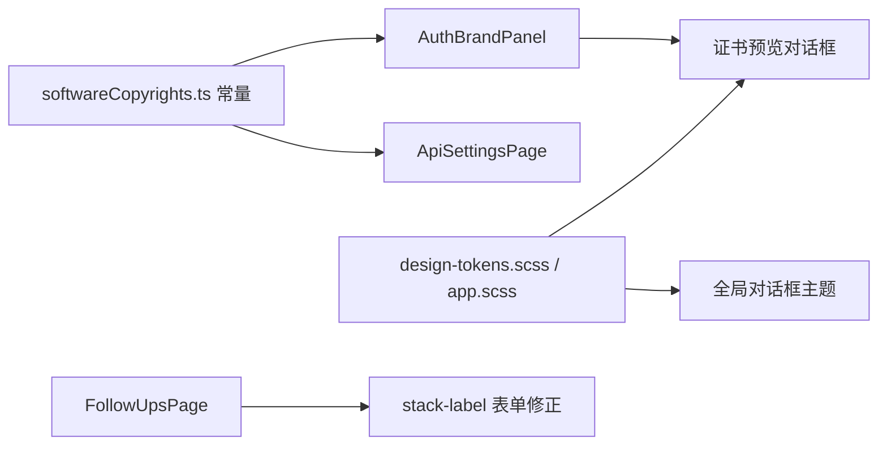

# 2026-03-09 认证页软著预览与对话框主题优化

本文档记录本轮围绕“认证品牌信任表达 + 证书预览交互 + 对话框主题一致性”完成的增量更新。

## 更新日期

2026年3月9日

## 提交与变更来源

- `9f76268` - `feat(auth): 添加软件著作权证书预览功能`
- `b43b1b9` - `style(dialog): 优化对话框样式和暗黑主题设计令牌`

> **本文档引用文件**
>
> - `src/constants/softwareCopyrights.ts`
> - `src/components/auth/AuthBrandPanel.vue`
> - `src/components/auth/AuthSplitLayout.vue`
> - `src/pages/ApiSettingsPage.vue`
> - `src/css/design-tokens.scss`
> - `src/css/app.scss`
> - `src/pages/FollowUpsPage.vue`

---

## 一、认证页新增软件著作权预览

### 1.1 统一的数据来源

- 新增 `src/constants/softwareCopyrights.ts`
- 软著名称、版本、登记号、证书号、图片地址统一由常量维护
- 认证品牌区与 API 设置页复用同一份数据，避免手写重复内容

### 1.2 卡片与对话框交互

- `AuthBrandPanel` 底部新增软件著作权卡片列表
- 点击卡片可打开证书预览对话框
- 缺失图片时给出明确提示，不出现空白预览

---

## 二、认证布局与可访问性细节修正

### 2.1 滚动与溢出修复

- `AuthSplitLayout` 修复 overflow 问题
- 长内容、证书预览或较小屏幕场景下，不再出现内容被裁切的情况

### 2.2 品牌区信息表达增强

- 在不改变医疗稳重风格的前提下，补充软著资产展示
- 保持现有品牌监控面板与实时指标节奏，不影响原有“今日处理量”展示偏好

---

## 三、对话框主题令牌与随访表单修正

### 3.1 对话框视觉统一

- 对话框背景从纯色调整为渐变底
- 边框、正文文字、辅助文字、蒙版颜色统一到设计令牌
- 浅色与深色模式下的层次和对比度同步校正

### 3.2 随访表单标签显示优化

- `FollowUpsPage` 的关键输入框补充 `stack-label`
- 避免在较窄宽度与深色背景下出现标签与内容挤压重叠

---

## 四、结构关系示意



---

## 五、关键代码片段

```ts
export const SORTED_SOFTWARE_COPYRIGHTS = [...SOFTWARE_COPYRIGHTS].sort(
  (a, b) => parseRegistrationNo(b.registrationNo) - parseRegistrationNo(a.registrationNo),
);
```

```vue
<article
  v-for="copyright in sortedSoftwareCopyrights"
  :key="copyright.id"
  class="copyright-card copyright-card--clickable"
  @click="openCertificatePreview(copyright)"
>
```

---

## 六、结果总结

- ✅ 认证品牌区与设置页已支持软件著作权卡片和证书预览
- ✅ 证书信息改为常量统一维护，降低后续维护成本
- ✅ 对话框视觉在浅色/深色主题下完成统一收口
- ✅ 随访表单标签显示稳定性得到修正
