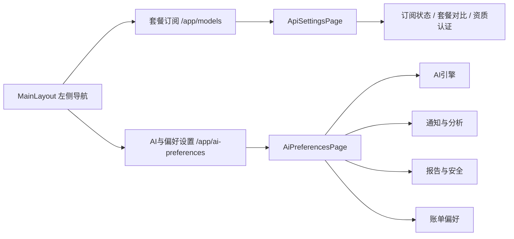

# 2026-03-11 套餐订阅与 AI 偏好页拆分

本文档记录本轮围绕“订阅信息聚焦 + AI 参数与服务偏好独立成页 + 导航结构同步”完成的增量更新。

## 更新日期

2026年3月11日

## 提交与变更来源

> **本文档引用文件**
>
> - `src/pages/ApiSettingsPage.vue`
> - `src/pages/AiPreferencesPage.vue`
> - `src/layouts/MainLayout.vue`
> - `src/router/routes.ts`

---

## 一、订阅页与偏好页职责拆分

### 1.1 套餐订阅页收敛为纯订阅场景

- `ApiSettingsPage.vue` 页头文案由“订阅与AI设置”调整为“套餐订阅”
- 页面保留订阅 Hero、套餐档位、状态卡、能力对比、性能指标、技术特性、订阅指南和资质认证
- 原先混在订阅页中的 AI 引擎配置与服务偏好设置整体移出，避免长页中业务职责混杂

### 1.2 新增独立的 AI 与偏好设置页

- 新增 `AiPreferencesPage.vue`
- 将模型引擎、通知策略、分析习惯、报告导出、隐私安全与账单偏好独立收拢
- 页面结构改为“顶部概览 + Tabs 分类”而非订阅长页直铺，更接近系统设置类信息架构

---

## 二、导航与路由同步

### 2.1 左侧导航改名与新增入口

- 原导航项“订阅与AI设置”改为“套餐订阅”
- 新增“AI与偏好设置”导航入口
- 左侧导航语义从“一个入口承载两类职责”调整为“订阅 / 配置”分离

### 2.2 路由层新增独立页面

- 保留 `/app/models` 对应 `ApiSettingsPage.vue`
- 新增 `/app/ai-preferences` 对应 `AiPreferencesPage.vue`
- `MainLayout` 中的 `EssentialLink` 路由表同步更新

---

## 三、页面表达与 UI 收口

### 3.1 新页顶部信息表达收口

- 新页顶部说明由内部方案式标语改为更接近正式产品界面的简洁表达
- Hero 标题字体、字号与订阅页保持一致，统一为衬线大标题体系
- 首屏大块留白压缩，避免“设置页像宣传页”的不协调感

### 3.2 参数分组更接近真实操作流程

- `AI引擎` Tab 仅承载模型版本、置信度阈值与敏感性
- `通知与分析` Tab 负责渠道、免打扰、分析习惯和热力图样式
- `报告与安全` Tab 负责默认导出、影像质量、水印、脱敏和二次验证
- `账单偏好` Tab 负责自动续费、余额预警与阈值说明

---

## 四、结构关系示意



---

## 五、关键代码片段

```ts
{
  path: 'ai-preferences',
  name: 'ai-preferences',
  component: () => import('pages/AiPreferencesPage.vue'),
}
```

```ts
{
  title: '套餐订阅',
  caption: '套餐权益',
  icon: 'api',
  route: '/app/models',
},
{
  title: 'AI与偏好设置',
  caption: '引擎与服务',
  icon: 'tune',
  route: '/app/ai-preferences',
}
```

---

## 六、结果总结

- ✅ 套餐订阅页已聚焦为纯订阅/权益展示场景
- ✅ AI 引擎与服务偏好已拆分为独立页面并分组展示
- ✅ 左侧导航与前端路由已完成同步更新
- ✅ 新页首屏表达与字体体系已向订阅页统一收口
