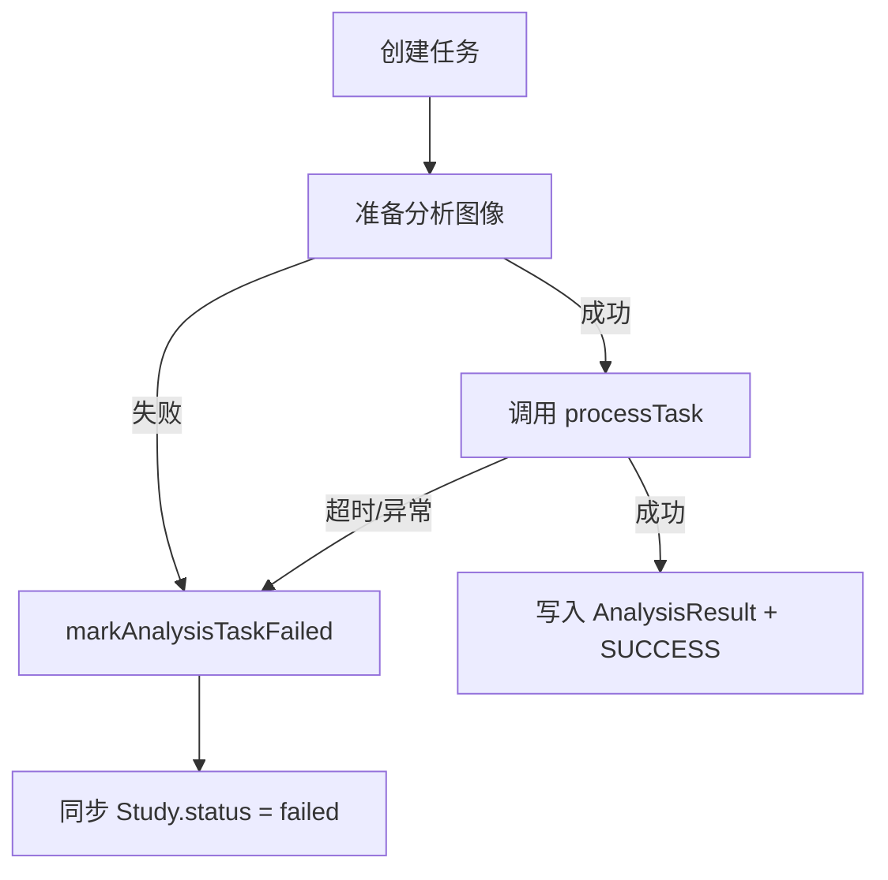

# 2026-03-12 分析任务稳定性修复

本文档记录本轮围绕“分析失败率偏高 + 病例详情页长时间卡在 85%”完成的稳定性修复，覆盖后端任务状态机、通义千问响应解析容错、异步入口失败收口，以及前端轮询单飞行控制。

## 更新日期

2026年3月12日

## 提交与变更来源

> **本文档引用文件**
>
> - `server/services/analysisService.js`
> - `server/services/qwenService.js`
> - `server/routes/analysis-tasks.js`
> - `server/routes/analyze.js`
> - `server/routes/studies.js`
> - `src/pages/StudyDetailPage.vue`
> - `src/stores/analysisStore.ts`
> - `README.md`

---

## 一、问题定位与修复目标

本轮修复的目标不是让前端拿到“模型真实百分比”，而是让任务链路具备可预测的终态行为：

- 杜绝任务长时间停留在 `PENDING / PROCESSING / 85%`
- 杜绝异步预处理异常只打印日志、不落失败态
- 降低通义千问输出轻微格式噪声导致的直接失败概率
- 避免病例详情页轮询并发导致旧响应覆盖新终态

---

## 二、后端任务状态机统一收口

### 2.1 新增统一失败收口函数

`analysisService.js` 新增统一的失败处理逻辑：

- 同时更新 `AnalysisTask.status`
- 回写 `progress`、`error_message`、`completed_at`
- 记录 `processing_time`
- 同步更新 `Study.status = failed`

这样无论失败发生在模型调用、图像预处理还是后台触发阶段，数据库都会进入一致的失败态。

### 2.2 增加分析超时保护

- 新增环境变量 `ANALYSIS_TIMEOUT_MS`
- 默认值为 `180000ms`
- 超时后统一返回“AI分析超时，请重试”

```js
const result = await withAnalysisTimeout(
  qwenService.analyzeImage(imagePath, modality),
  resolveAnalysisTimeoutMs(),
);
```

### 2.3 进度语义保持诚实

- `0-85%` 仍然是阶段性估算进度
- `90/95/100` 仅在模型成功返回并完成结果落库后推进
- 文档明确声明 `SUCCESS / FAILED` 才是可靠终态

---

## 三、异步入口补齐失败落库

`POST /api/analyze`、`POST /api/analysis-tasks`、`POST /api/analysis-tasks/batch` 现在统一具备以下收口能力：

- 图像路径解析失败时直接落 `FAILED`
- 找不到病例主图或最新图时直接落 `FAILED`
- 异步预处理抛错时直接落 `FAILED`
- 后台触发分析异常时直接落 `FAILED`



---

## 四、通义千问响应解析容错增强

### 4.1 从“严格纯 JSON”改为“提取首个 JSON 对象”

此前模型只要返回：

- Markdown 代码围栏
- JSON 前后附带解释文字
- 轻微格式噪声

就可能直接解析失败。

本轮改为三步容错：

1. 去除 Markdown 代码围栏
2. 尝试直接解析完整文本
3. 若失败，再提取首个完整 JSON 对象进行解析

### 4.2 补充耗时与失败阶段日志

日志现在会区分：

- `response_validate`
- `response_parse`
- `api_request`
- `runtime`

便于后续定位到底是模型接口超时、响应格式异常，还是本地运行时错误。

---

## 五、前端轮询改为单飞行模式

### 5.1 解决并发轮询覆盖问题

`StudyDetailPage.vue` 原本使用 `setInterval + async`，存在以下风险：

- 新一次轮询尚未返回，下一次请求又已发出
- 旧响应晚到后覆盖新状态
- 成功后又被旧的 `PROCESSING / 85%` 响应打回

本轮改为：

- `setTimeout` 递归调度
- 同时仅允许一个状态请求在飞
- 使用 `pollingSessionToken` 忽略旧会话响应

### 5.2 新增自动停止保护

- 连续 3 次状态请求失败后，停止自动轮询并强制刷新病例数据
- 任务进度 `>=80%` 且长时间不变时，提示“任务可能卡住”
- 若刷新后已拿到 `analysisResult`，则直接同步为完成态

```ts
if (pollingFailureCount >= MAX_POLLING_FAILURES) {
  await stopPollingAndRefresh({
    statusText: '状态同步失败',
    logMessage: '分析状态请求连续失败，已停止自动轮询',
    notifyMessage: '分析状态同步连续失败，已停止自动轮询，请稍后重试',
  });
}
```

---

## 六、病例详情回填一致性修复

`GET /api/studies` 与 `GET /api/studies/:id` 现在对 `analysis_tasks` 与 `analysis_results` 使用单独排序查询，优先返回最新记录：

- 避免刷新详情页后又绑定回历史旧任务
- 避免已有结果时仍被旧的处理中任务覆盖
- 配合前端 mapper，页面能更稳定地恢复到最新终态

---

## 七、结果总结

- ✅ 后端分析任务具备统一失败收口与默认 180 秒超时保护
- ✅ 通义千问响应支持围栏文本与首个 JSON 对象提取，降低格式噪声失败率
- ✅ 病例详情页轮询改为单飞行模式，避免旧响应覆盖新终态
- ✅ 高进度卡住和连续请求失败场景均有自动停止与刷新保护
- ✅ README 与 API 文档已同步“阶段进度估算 + 终态可靠”的状态语义
