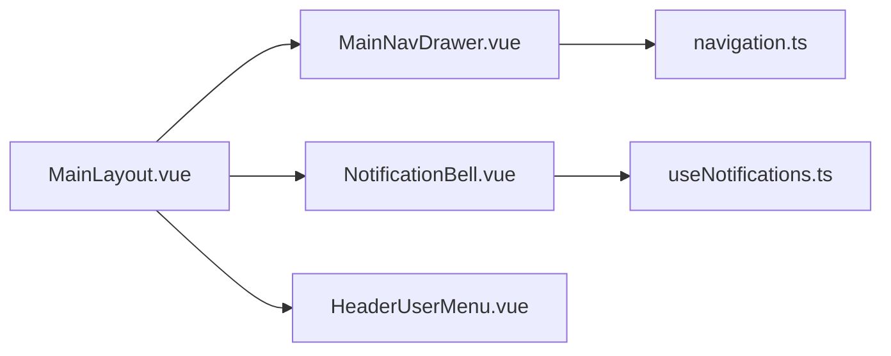

# 2026-03-12 前端渐进重构与通知链路收口

本文档记录提交 `f43e248826106fc8c28430717f54b029b6b77acf` 引入的前端渐进式重构与随访提醒通知链路收口，覆盖主布局装配化、病例中心查询状态重组、病例数据映射统一、AI 偏好页模块化，以及手动提醒的多接收人投递策略。

## 更新日期

2026年3月12日

## 提交与变更来源

> **提交信息**
>
> - `f43e248826106fc8c28430717f54b029b6b77acf`
> - `refactor(app): 重构主布局与随访提醒逻辑，优化AI偏好页面`
>
> **本文档引用文件**
>
> - `src/layouts/MainLayout.vue`
> - `src/components/layout/NotificationBell.vue`
> - `src/components/layout/HeaderUserMenu.vue`
> - `src/components/layout/MainNavDrawer.vue`
> - `src/composables/useNotifications.ts`
> - `src/constants/navigation.ts`
> - `src/pages/StudiesPage.vue`
> - `src/stores/studyStore.ts`
> - `src/utils/studyMappers.ts`
> - `src/utils/studiesQuery.ts`
> - `src/composables/useStudyReportDownload.ts`
> - `src/pages/AiPreferencesPage.vue`
> - `src/composables/useAiPreferences.ts`
> - `src/pages/ApiSettingsPage.vue`
> - `src/composables/useSubscriptionPlans.ts`
> - `server/routes/followups.js`
> - `docs/frontend-regression-checklist.md`

---

## 一、主布局回归装配层

### 1.1 布局职责拆分

- `MainLayout.vue` 不再直接承载通知请求、通知面板模板、用户菜单和导航配置。
- 顶部栏拆为：
  - `NotificationBell.vue`
  - `HeaderUserMenu.vue`
  - `MainNavDrawer.vue`
- 主导航配置迁入 `src/constants/navigation.ts`，新增导航项或调整分组时无需优先修改主布局文件。

### 1.2 通知逻辑收口

- `useNotifications.ts` 统一处理通知列表加载、未读数刷新、单条已读、全部已读和跳转分发。
- 布局层只负责挂载通知组件，不再关心通知业务细节。
- 这让主布局从“页面 + 业务 + 样式全集中”收敛为更稳定的装配层。



---

## 二、病例中心改为查询状态驱动

### 2.1 查询状态与 URL 同步

- `StudiesPage.vue` 将原来的零散筛选项收口为统一查询状态。
- 新增 `src/utils/studiesQuery.ts`，用于：
  - `parseStudiesQuery(route.query)`
  - `buildStudiesQuery(state)`
- 当前同步字段包括：
  - `status`
  - `patient_id`
  - `keyword`
  - `page`
  - `rowsPerPage`

### 2.2 列表行为重构

- `q-table` 分页状态改为受控模式。
- 删除病例后不再无条件全量重拉，而是优先依赖 store 内局部状态更新。
- PDF 下载流程抽到 `useStudyReportDownload.ts`，页面保留按钮入口与提示反馈。

```ts
const nextQuery = buildStudiesQuery(queryState.value);
await router.replace({
  query: {
    ...mergedQuery,
    ...nextQuery,
  },
});
```

---

## 三、病例数据映射统一到 store 边界

### 3.1 映射与状态推导收口

- `studyStore.ts` 保持病例主状态入口，但把原先混在 store 内的映射细节迁出。
- 新增 `src/utils/studyMappers.ts`，统一处理：
  - `StudyRaw -> Study`
  - 展示状态推导
  - 最新任务状态归一化
  - 置信度归一化

### 3.2 收口后的收益

- 列表页与详情页共用同一套病例映射口径。
- `Study` 类型迁入 `src/types/study.ts`，避免页面私自扩散字段结构。
- `studyStore` 新增分页状态定义，为未来切换服务端分页预留了统一接口面。

```ts
export function resolveStudyDisplayStatus(raw: StudyRaw): StudyDisplayStatus {
  const latestTaskStatus = resolveLatestTaskStatus(raw.analysis_tasks);
  const hasAnalysisResult = Boolean(raw.analysis_results?.[0]);

  if (hasAnalysisResult) return 'completed';
  if (latestTaskStatus === 'PENDING' || latestTaskStatus === 'PROCESSING') return 'processing';
  if (latestTaskStatus === 'FAILED' && raw.status === 'processing') return 'failed';
  return raw.status;
}
```

---

## 四、偏好页与订阅页模块化

### 4.1 AI 偏好页模块化

- `AiPreferencesPage.vue` 不再承载默认值、选项常量、摘要逻辑和本地存储细节。
- 新增：
  - `src/composables/useAiPreferences.ts`
  - `src/constants/preferences.ts`
  - `src/types/preferences.ts`

### 4.2 订阅页脚本收口

- `ApiSettingsPage.vue` 将套餐数据、支付流程和权益演示逻辑迁入 `useSubscriptionPlans.ts`。
- 页面主文件更接近“结构模板 + 交互挂载”，降低后续继续膨胀的风险。

---

## 五、手动提醒改为多接收人同步投递

### 5.1 路由行为调整

- `POST /api/followups/:id/remind` 原先只会通知 `assigned_doctor_id || created_by`。
- 本轮改为对以下用户做去重后投递：
  - `assigned_doctor_id`
  - `created_by`
  - 当前操作者 `req.user.id`

### 5.2 前端体验收益

- 随访列表点击“立即发送提醒”后，当前操作者自己的通知中心也能马上看到新提醒。
- 这避免了“接口返回成功，但当前页面看不到任何未读变化”的体验断层。

```ts
const receiverIds = Array.from(
  new Set([followUp.assigned_doctor_id, followUp.created_by, req.user.id].filter(Boolean)),
);
```

---

## 六、质量保障补齐

- 新增 `docs/frontend-regression-checklist.md`
- 本轮把高风险回归点显式写成检查项，覆盖：
  - 病例列表筛选与分页 URL 同步
  - 通知面板加载、已读与跳转
  - AI 偏好页保存与重置
  - 套餐订阅弹窗与支付演示流程
  - 随访管理“立即发送提醒”后的通知联动
- `package.json` 增加 `typecheck` 脚本，用于大改后的静态类型收口

---

## 七、结果总结

- ✅ 主布局从重业务文件收口为装配层
- ✅ 病例中心具备查询状态驱动与 URL 同步结构
- ✅ 病例映射与展示状态推导统一到 mapper 层
- ✅ AI 偏好页与订阅页完成 composable 级脚本拆分
- ✅ 手动提醒支持多接收人同步通知，当前操作者可立即感知结果
- ✅ 回归检查清单与 `typecheck` 脚本补齐，便于大改后静态验证
