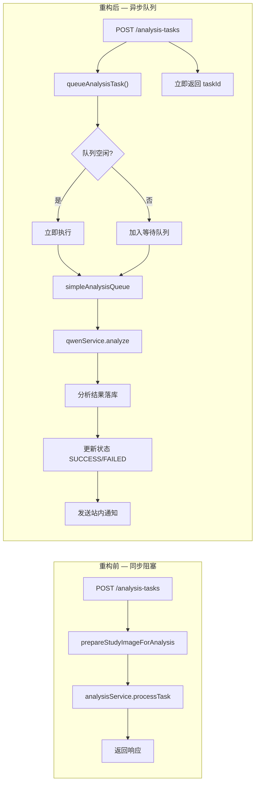

# 2026-03-20 分析任务队列化重构

> **日期**: 2026-03-20
> **提交**: `7d088fd` + `1fe1a25`
> **类型**: 重构（refactor）

## 变更摘要

本次提交将图像分析任务触发逻辑从**同步执行**改为**异步队列处理**，避免阻塞主线程，并增强了日志可观测性。

## 核心变更

### 1. 新增任务队列服务

新增 `server/services/simpleAnalysisQueue.service.js`，实现轻量级内存队列：

| 特性 | 说明 |
| :--- | :--- |
| **并发控制** | 支持配置最大并发数（默认 3），通过 `MAX_CONCURRENT_ANALYSIS` 环境变量调整 |
| **无需 Redis** | 适用于小型部署或开发环境 |
| **任务状态追踪** | 支持查询队列运行状态（`running`/`waiting`/`concurrency`） |

```javascript
// 队列使用示例
const { queueAnalysisTask } = require('../services/simpleAnalysisQueue.service.js');

// 添加任务到队列
await queueAnalysisTask(taskId, studyId, studyImage);
```

### 2. 路由层改造

`server/routes/analysis-tasks.js` 两处触发点统一改为队列调用：

| 接口 | 变更 |
| :--- | :--- |
| `POST /analysis-tasks` | 直接调用 `queueAnalysisTask`，移除 `prepareStudyImageForAnalysis` 同步预处理 |
| `POST /analysis-tasks/batch` | 批量任务改为 `.catch()` 降级处理，由队列内部自动处理图像路径准备 |

### 3. 通义千问服务增强

`server/services/qwenService.js` 日志与超时优化：

| 变更项 | 变更内容 |
| :--- | :--- |
| **超时配置** | 默认从 60s 延长至 **180s**，可通过 `QWEN_API_TIMEOUT_MS` 环境变量调整 |
| **重试延迟** | 递增延迟从 `1s/2s/3s` 调整为 **3s/6s/9s** |
| **请求日志** | 新增图像来源（远程 URL / 本地文件）、检查方式、超时配置的详细输出 |
| **错误日志** | 分阶段详细输出：stage / 耗时 / 剩余重试次数 / 错误消息 / 状态码 / 响应数据 / 错误代码 |

## 环境影响变量

| 变量名 | 默认值 | 说明 |
| :--- | :---: | :--- |
| `MAX_CONCURRENT_ANALYSIS` | `3` | 分析任务最大并发数 |
| `QWEN_API_TIMEOUT_MS` | `180000` | 通义千问 API 超时（毫秒） |

## 架构变化



## 文件变更清单

| 文件 | 变更类型 |
| :--- | :--- |
| `server/services/simpleAnalysisQueue.service.js` | **新增** |
| `server/routes/analysis-tasks.js` | 修改 |
| `server/services/qwenService.js` | 修改 |

## 关联文档

- [[AI分析服务]] - 任务队列机制已补充至服务层说明
- [[AI分析任务API]] - 异步队列触发逻辑已更新

---

返回 [[更新日志]]
