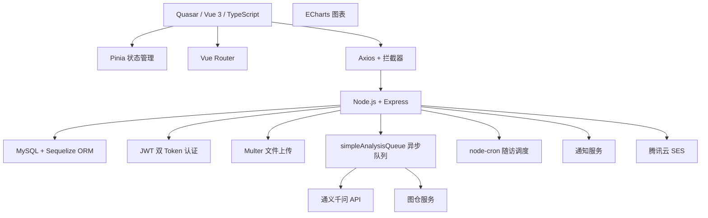
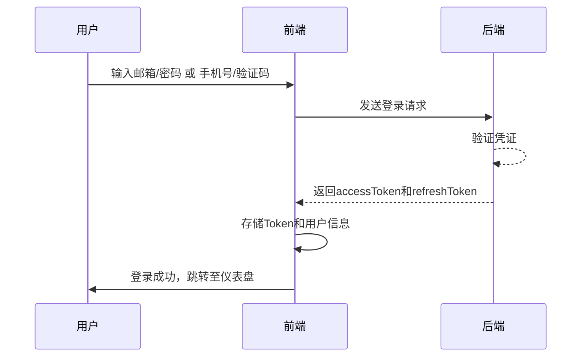
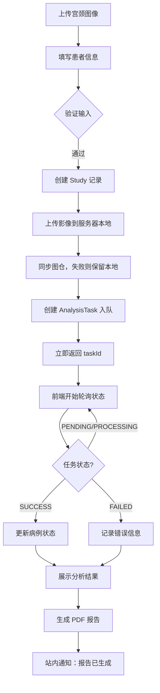
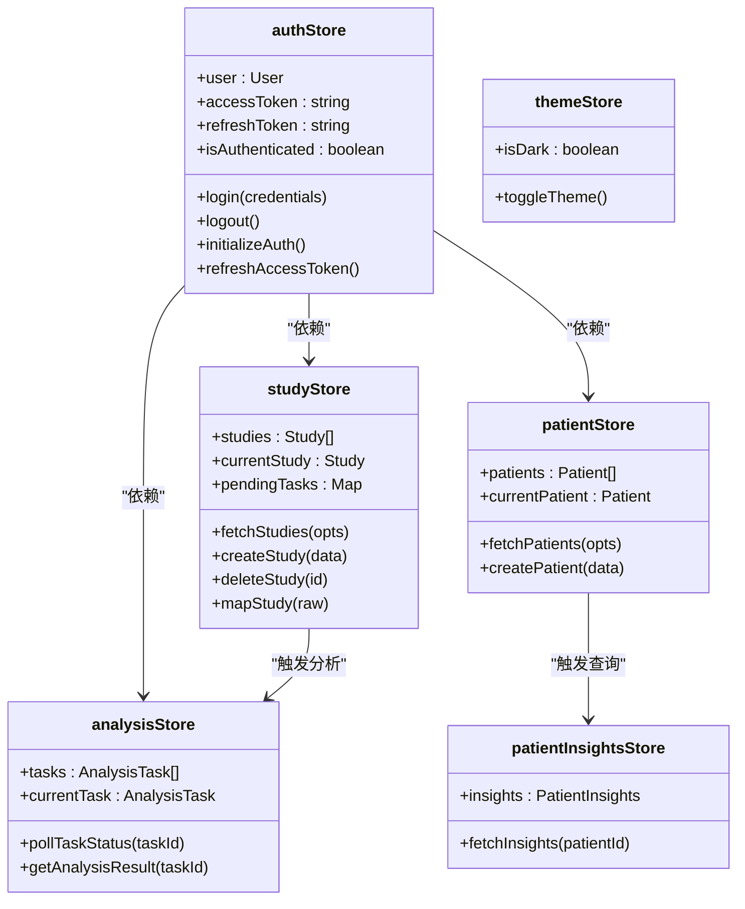

# 系统概述

> **本文档引用文件**  
> - [README.md](file://README.md)
> - [package.json](file://package.json)
> - [server/index.js](file://server/index.js)
> - [src/App.vue](file://src/App.vue)
> - [src/router/index.ts](file://src/router/index.ts)
> - [src/stores/authStore.ts](file://src/stores/authStore.ts)
> - [src/stores/studyStore.ts](file://src/stores/studyStore.ts)
> - [src/stores/analysisStore.ts](file://src/stores/analysisStore.ts)
> - [src/pages/LoginPage.vue](file://src/pages/LoginPage.vue)
> - [src/pages/UploadPage.vue](file://src/pages/UploadPage.vue)
> - [src/pages/ReportsPage.vue](file://src/pages/ReportsPage.vue)
> - [server/routes/analyze.js](file://server/routes/analyze.js)
> - [server/routes/studies.js](file://server/routes/studies.js)
> - [server/routes/reports.js](file://server/routes/reports.js)

## 目录
1. [项目简介](#项目简介)
2. [核心功能模块](#核心功能模块)
3. [目标用户群体](#目标用户群体)
4. [系统工作流程](#系统工作流程)
5. [技术架构概览](#技术架构概览)
6. [用户认证流程](#用户认证流程)
7. [病例管理与AI分析](#病例管理与ai分析)
8. [报告生成与下载](#报告生成与下载)
9. [系统设置与信息](#系统设置与信息)
10. [架构设计洞察](#架构设计洞察)

## 项目简介

CervixDetectAI 是一个基于 Quasar 框架开发的宫颈癌影像AI辅助筛查SaaS云平台。该项目采用“互联网+医疗”的电子商务SaaS模式，通过云端提供服务，医疗机构可按次、按年或定制化购买服务，极大降低了初始投入门槛，实现了筛查服务的“即插即用”。项目通过自研算法，在保持高准确率的同时显著降低了计算成本和参数数量，使其能在基层医疗机构的普通硬件上流畅运行。

**Section sources**
- [README.md](file://README.md#L1-L11)

## 核心功能模块

系统主要包含五大功能模块：用户认证、病例管理、AI分析、报告系统和系统设置。用户认证模块支持邮箱和手机号登录，采用JWT双Token机制（accessToken有效期1小时，refreshToken有效期7天）进行会话管理。病例管理模块提供病例信息查看、状态跟踪和搜索筛选功能。AI分析模块支持宫颈图像上传、自动分析处理和实时进度跟踪。报告系统实现自动报告生成、下载和历史报告查看。系统设置模块允许用户管理个人信息、通知偏好和查看AI模型信息。

**Section sources**
- [README.md](file://README.md#L12-L44)

## 目标用户群体

本系统主要面向三类用户：医生、医疗机构和研究人员。医生可通过平台上传患者宫颈图像，获取AI辅助诊断结果，提高诊断效率和准确性。医疗机构可利用该SaaS平台降低技术门槛，实现宫颈癌筛查服务的普惠化。研究人员可访问系统中的病例数据和分析结果，用于医学研究和模型优化。系统通过权限控制确保数据安全，不同角色用户拥有相应的访问权限。

**Section sources**
- [README.md](file://README.md#L250-L257)

## 系统工作流程

系统的完整工作流程从用户登录开始，经过图像上传、AI分析到报告生成形成闭环。用户首先通过邮箱或手机号登录系统，然后进入病例管理界面。在上传新病例时，用户填写患者基本信息并上传宫颈图像。系统接收图像后创建AI分析任务，并实时显示分析进度。分析完成后，系统自动生成包含诊断结果、置信度、临床建议和生物标志物信息的PDF报告，用户可随时查看和下载。

**Section sources**
- [README.md](file://README.md#L258-L278)

## 技术架构概览

系统采用前后端分离架构，前端基于Quasar框架（Vue 3 + TypeScript），后端基于Node.js + Express。前端使用Pinia进行状态管理，Vue Router进行路由管理，Axios进行HTTP请求。后端使用MySQL数据库（Sequelize ORM）存储数据，JWT进行认证，Multer处理文件上传，并集成阿里云短信服务。前后端通过RESTful API进行通信，前端通过Vite构建，部署为SPA应用。

**Diagram sources**
- [README.md](file://README.md#L45-L64)
- [package.json](file://package.json#L1-L47)

## 用户认证流程

用户认证流程支持两种方式：邮箱登录和手机号登录。邮箱登录采用邮箱+密码的方式，而手机号登录则通过短信验证码实现。新用户通过手机号登录时会自动注册并登录。系统采用accessToken和refreshToken双Token机制，accessToken用于接口认证，refreshToken用于令牌刷新。前端通过authStore管理认证状态，初始化时从localStorage恢复认证信息，确保用户会话的持久性。

**Diagram sources**
- [src/stores/authStore.ts](file://src/stores/authStore.ts#L36-L218)
- [src/pages/LoginPage.vue](file://src/pages/LoginPage.vue#L152-L331)

## 病例管理与AI分析

病例管理与AI分析流程从图像上传开始。用户在UploadPage上传宫颈图像并填写患者信息后，系统调用uploadAndAnalyze方法。该方法验证输入后，通过uploadImage API将图像和病例信息发送到后端。后端接收后创建分析任务，返回任务ID和预计完成时间。前端使用analysisStore的pollTaskStatus方法轮询任务状态，实时更新分析进度。分析完成后，系统更新病例状态为“已完成”，并将结果存储在studyStore中。

**Diagram sources**
- [src/pages/UploadPage.vue](file://src/pages/UploadPage.vue#L262-L483)
- [server/routes/analyze.js](file://server/routes/analyze.js#L51-L378)

## 报告生成与下载

报告系统在AI分析完成后自动生成PDF报告。当分析任务状态变为“SUCCESS”时，系统调用报告生成接口，基于分析结果创建结构化的报告内容。用户可在ReportsPage查看已完成的病例报告列表，通过viewReport方法跳转到病例详情页查看详细结果，或通过downloadReport方法下载PDF报告。后端reports.js路由处理报告的生成、查询和下载请求，确保报告的安全访问和权限控制。

**Section sources**
- [src/pages/ReportsPage.vue](file://src/pages/ReportsPage.vue#L1-L127)
- [server/routes/reports.js](file://server/routes/reports.js#L1-L488)

## 系统设置与信息

系统设置模块允许用户管理个人信息和查看系统信息。在SettingsPage中，用户可查看应用版本、AI模型信息、发布日期和许可证类型。系统从token.json文件中读取默认管理员账户信息，并在登录后初始化认证状态。用户可通过个人资料页面管理头像、联系方式等信息。系统还提供检查更新功能，确保用户使用最新版本的AI模型和服务。

**Section sources**
- [src/pages/SettingsPage.vue](file://src/pages/SettingsPage.vue#L100-L123)
- [server/token.json](file://server/token.json#L1-L1)

## 架构设计洞察

系统架构设计体现了清晰的分层和模块化思想。前端采用Pinia进行集中式状态管理，authStore、studyStore和analysisStore分别管理认证、病例和分析任务状态，确保数据流的可预测性。后端通过Express路由将不同功能模块分离，analyze.js、studies.js和reports.js各司其职。数据库设计遵循规范化原则，通过Sequelize模型定义表结构和关联关系。整个系统通过JWT认证中间件保护API接口，确保只有授权用户才能访问敏感数据。

**Diagram sources**
- [src/stores/authStore.ts](file://src/stores/authStore.ts#L1-L219)
- [src/stores/studyStore.ts](file://src/stores/studyStore.ts#L1-L267)
- [src/stores/analysisStore.ts](file://src/stores/analysisStore.ts#L1-L194)