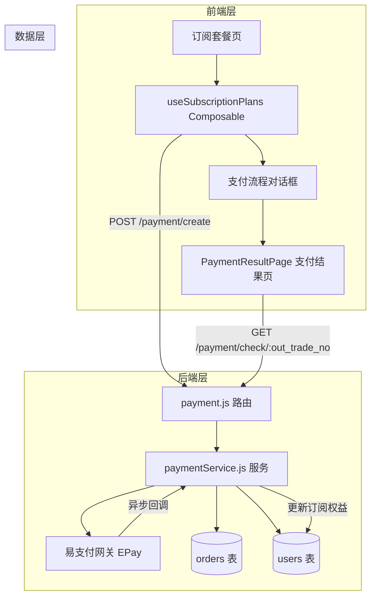
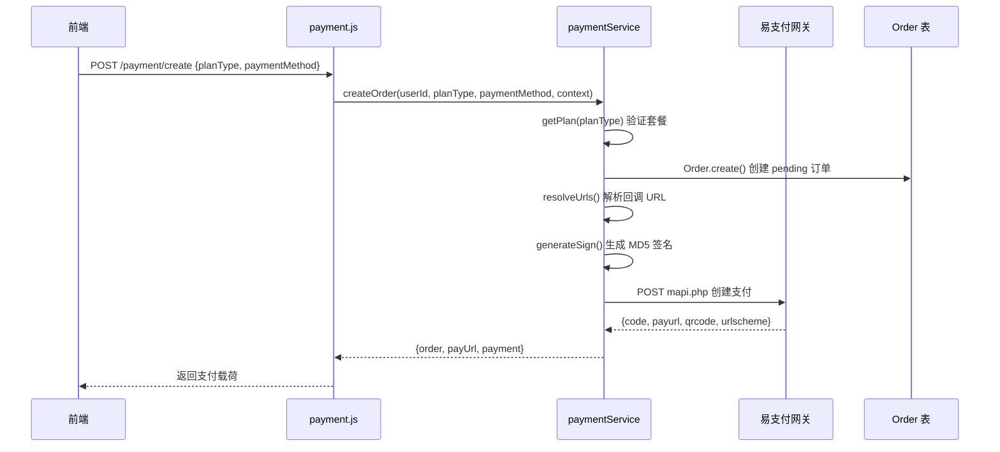
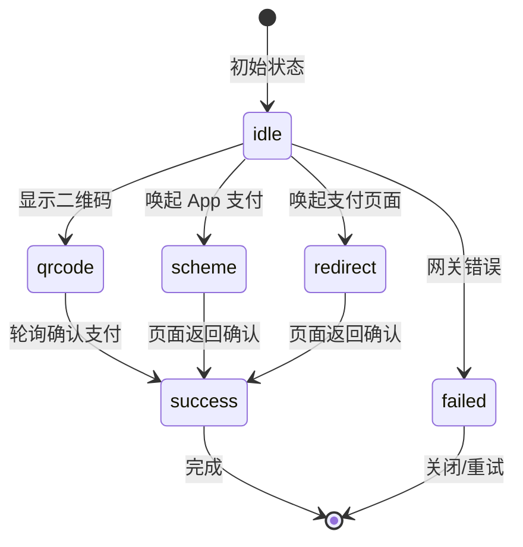

# 订阅与支付系统

本文档详细阐述 CervixDetectAI 系统中订阅套餐、支付网关集成与权益发放的完整技术架构。

> **本文档引用文件**
> - [paymentService.js](file://server/services/paymentService.js)
> - [payment.js](file://server/routes/payment.js)
> - [useSubscriptionPlans.ts](file://src/composables/useSubscriptionPlans.ts)
> - [ApiSettingsPage.vue](file://src/pages/ApiSettingsPage.vue)
> - [PaymentResultPage.vue](file://src/pages/PaymentResultPage.vue)

## 目录

1. [系统架构概览](#系统架构概览)
2. [套餐体系设计](#套餐体系设计)
3. [后端支付服务](#后端支付服务)
4. [数据模型设计](#数据模型设计)
5. [前端订阅管理](#前端订阅管理)
6. [支付结果处理](#支付结果处理)
7. [API端点参考](#api端点参考)

## 系统架构概览

订阅与支付系统采用前后端分离架构，后端处理与第三方支付网关的通信，前端管理套餐展示与支付流程。



## 套餐体系设计

### 套餐层级架构

系统采用双层套餐体系，分为基础套餐（Basic）和顶级套餐（Premium）。

| 套餐层级 | 计费模式 | 套餐代码 | 价格（元） | 周期 | 权益特点 |
|---------|---------|---------|-----------|------|---------|
| 基础套餐 | 按次试用 | `basic-trial-once` | 0.1 | 单次 | 三种检测方式 + 标准 PDF 报告 |
| 基础套餐 | 按次正式 | `basic-formal-once` | 9.9 | 单次 | 三种检测方式 + 标准 PDF 报告 |
| 基础套餐 | 连续包月 | `basic-monthly-auto` | 888 | 30 天 | 到期自动续费 |
| 基础套餐 | 一年版 | `basic-yearly` | 9,888 | 365 天 | 省 ¥1,872 |
| 顶级套餐 | 连续包月 | `premium-monthly-auto` | 999 | 30 天 | 五种检测方式 + 随访管理 |
| 顶级套餐 | 半年版 | `premium-half-year` | 6,699 | 180 天 | 省 ¥981 |
| 顶级套餐 | 一年版 | `premium-yearly` | 12,699 | 365 天 | 省 ¥699 |

## 后端支付服务

### 订单创建流程



### 权益发放机制

支付成功后调用 `fulfillBenefits` 方法，在数据库事务中完成订单状态更新与用户权益发放：

```javascript
async fulfillBenefits(order, tradeNo, options = {}) {
  const transaction = await sequelize.transaction();
  
  try {
    // 加锁查询订单
    const lockedOrder = await Order.findOne({
      where: { id: order.id },
      transaction,
      lock: transaction.LOCK.UPDATE,
    });
    
    // 权益发放逻辑
    user.remaining_credits = (user.remaining_credits || 0) + (plan.credits || 0);
    
    // 订阅模式：延长有效期
    if (plan.type === 'subscription' && plan.days) {
      const newExpiry = new Date(startDate.getTime() + plan.days * 24 * 60 * 60 * 1000);
      user.subscription_type = lockedOrder.plan_type;
      user.subscription_expires_at = newExpiry;
    }
    
    await transaction.commit();
    return lockedOrder;
  } catch (error) {
    await transaction.rollback();
    throw error;
  }
}
```

### 签名验证机制

支付安全通过 MD5 签名机制保障：

```javascript
generateSign(params) {
  const keys = Object.keys(params).sort();
  const signStr = keys
    .filter((key) => {
      const value = params[key];
      return key !== 'sign' && key !== 'sign_type' 
        && value !== '' && value !== undefined && value !== null;
    })
    .map((key) => `${key}=${params[key]}`)
    .join('&');

  return crypto
    .createHash('md5')
    .update(`${signStr}${this.key}`)
    .digest('hex');
}
```

## 数据模型设计

### Order 订单模型

| 字段 | 类型 | 说明 |
|-----|------|------|
| id | BIGINT | 主键，自增 |
| out_trade_no | STRING(64) | 商户订单号（唯一） |
| trade_no | STRING(64) | 第三方交易号 |
| user_id | BIGINT | 用户ID |
| type | STRING(20) | alipay/wxpay/bank |
| name | STRING(127) | 套餐名称 |
| money | DECIMAL(10,2) | 金额 |
| plan_type | STRING(50) | 套餐代码 |
| credits | INTEGER | 获得点数 |
| status | ENUM | pending/paid/failed/expired |
| pay_time | DATE | 支付时间 |
| notify_data | TEXT | 回调原始数据 |

### User 用户订阅字段

| 字段 | 类型 | 说明 |
|-----|------|------|
| subscription_type | ENUM | none/monthly/yearly/package |
| subscription_expires_at | DATE | 订阅到期时间 |
| remaining_credits | INTEGER | 剩余点数（按次模式） |

## 前端订阅管理

### 支付流程状态机



### 状态持久化与会话恢复

为支持支付过程中页面刷新后继续支付，composable 将支付状态持久化到 SessionStorage：

```typescript
const PENDING_PAYMENT_MAX_AGE_MS = 2 * 60 * 60 * 1000; // 2小时

const persistPendingPaymentState = (payment: PaymentGatewayData) => {
  setItem(
    STORAGE_KEYS.PENDING_PAYMENT_STATE,
    {
      payment,
      paymentMethod: selectedPaymentMethod.value,
      createdAt: Date.now(),
    },
    'session',
  );
};
```

## 支付结果处理

### 支付结果页轮询机制

```typescript
const MAX_POLL_COUNT = 15;

onMounted(() => {
  if (!outTradeNo) {
    status.value = 'failed';
    return;
  }

  void checkStatus();  // 立即查询一次

  // 启动轮询
  pollTimer = setInterval(() => {
    pollCount++;
    if (pollCount > MAX_POLL_COUNT) {
      clearInterval(pollTimer);
      status.value = 'failed';
      errorMessage.value = '查询超时，请手动刷新';
      return;
    }
    void checkStatus();
  }, 2000);
});
```

## API端点参考

| 端点 | 方法 | 认证 | 功能 |
|------|------|------|------|
| `/payment/create` | POST | 必须 | 创建支付订单 |
| `/payment/check/:out_trade_no` | GET | 不需要 | 公开查询订单状态 |
| `/payment/status/:out_trade_no` | GET | 必须 | 认证后查询订单详情 |
| `/payment/orders` | GET | 必须 | 获取用户订单列表 |
| `/payment/notify` | GET/POST | 不需要 | 支付网关异步回调 |
| `/payment/return` | GET | 不需要 | 支付网关同步跳转 |

## 相关文档

- [[订阅与支付功能]] — 前端订阅组件架构
- [[API接口规范]] — 完整的 API 端点参考
- [[用户认证系统]] — 用户认证机制如何与订阅权益联动
