# CervixDetectAI 宫颈癌AI辅助诊断系统

## 项目技术报告

<div align="center">

**参赛学生**：[姓名] 　　**指导教师**：[教师]

**技术架构**：Vue 3 + Quasar / Node.js + Express / MySQL + Sequelize

**完成日期**：2026年4月

</div>

---

## 第一章 需求分析

### 1.1 项目背景

宫颈癌是全球女性最常见的恶性肿瘤之一。传统筛查依赖经验丰富的病理医生，存在专业人才不足、效率低、一致性差等问题。本作品开发一款基于"互联网+医疗"的宫颈癌AI辅助筛查SaaS云平台，基层医疗机构可订阅使用，降低筛查门槛，实现"即插即用"。

### 1.2 竞品分析

| 维度         | 本作品               | 传统大型AI平台         | 第三方SaaS     |
| ------------ | -------------------- | ---------------------- | -------------- |
| **部署方式** | SaaS云服务，订阅制   | 私有化部署，硬件要求高 | SaaS云服务     |
| **成本模式** | 按次/年订阅，低门槛  | 一次性买断，高昂       | 按调用次数计费 |
| **功能覆盖** | 筛查+报告+随访全链路 | 仅AI分析               | 功能单一       |
| **适用场景** | 基层医疗机构         | 大型医院               | 中型医疗机构   |

**本作品差异化定位**：面向**基层医疗机构**的普惠型AI筛查工具，强调低成本、高易用、全流程覆盖。

### 1.3 目标用户

| 用户类型 | 核心需求                           |
| -------- | ---------------------------------- |
| 基层医生 | 快速上传影像、获取AI诊断、生成报告 |
| 医疗机构 | 多用户协作、患者数据管理           |
| 研究人员 | 病例数据导出与分析                 |

### 1.4 主要功能与技术指标

**九大核心功能模块**：

| 功能模块        | 功能描述                                 | 技术亮点               |
| --------------- | ---------------------------------------- | ---------------------- |
| 🔐 **用户认证** | 邮箱/手机/AI验证码多模式登录，JWT双Token | 阿里云AI验证码防机器人 |
| 👥 **患者管理** | 患者档案、健康史、随访管理               | 扩展字段、批量操作     |
| 📋 **病例管理** | 病例创建、影像上传、状态流转             | 拖拽批量上传、多维筛选 |
| 🤖 **AI分析**   | 宫颈图像识别、风险分级、置信度           | 流式对话、深度思考模式 |
| 📄 **报告生成** | PDF报告自动生成、下载、历史追溯          | 结构化报告、医师备注   |
| 💳 **订阅支付** | 多档套餐、易支付集成、权益发放           | 异步回调、自动续费     |
| 🔔 **站内通知** | 分析完成提醒、高风险预警、随访提醒       | 定时调度、实时推送     |
| 📅 **随访管理** | 随访计划、自动提醒、重点关注标记         | node-cron定时任务      |
| ⚙️ **偏好设置** | AI引擎选择、通知偏好、报告偏好           | 个性化配置             |

**性能指标**：API响应 < 500ms；AI分析单张 < 30秒；支持 100+ 并发；软删除保留审计轨迹。

---

## 第二章 概要设计

### 2.1 系统架构

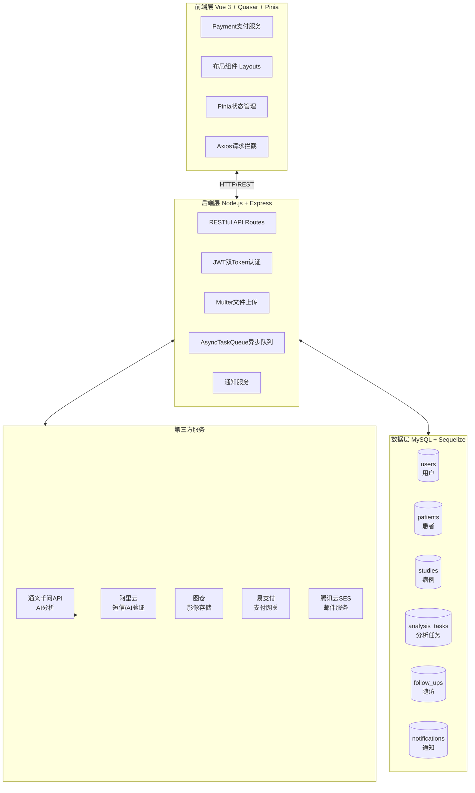

### 2.2 前端组件架构

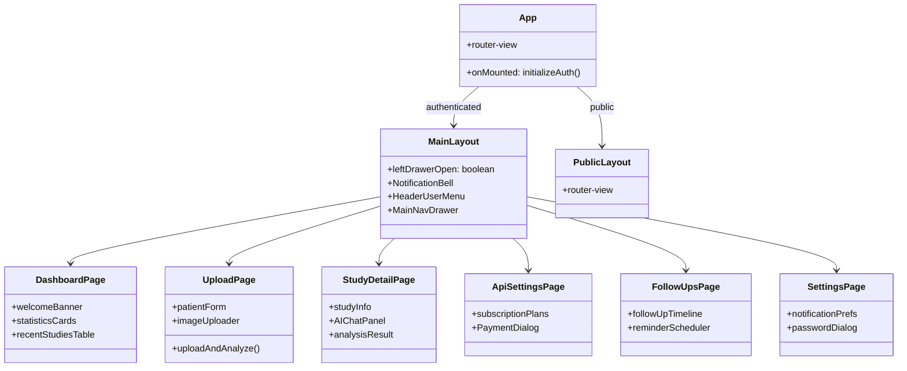

### 2.3 核心数据模型

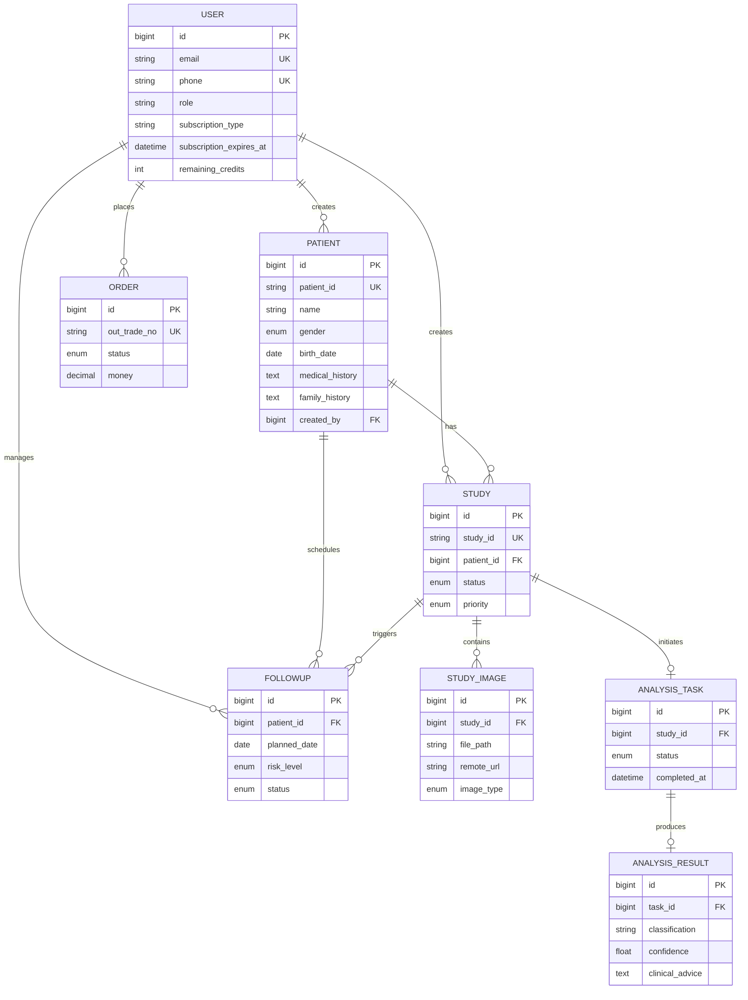

### 2.4 核心业务流程

#### 病例分析完整流程

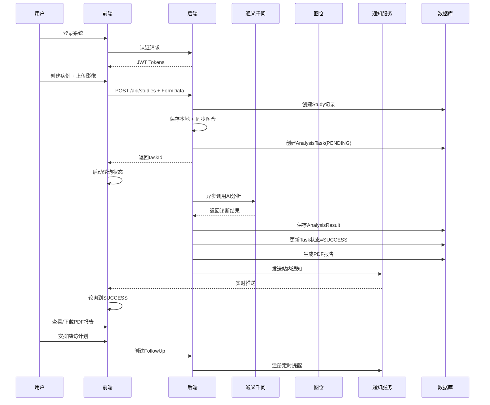

#### 支付订阅流程

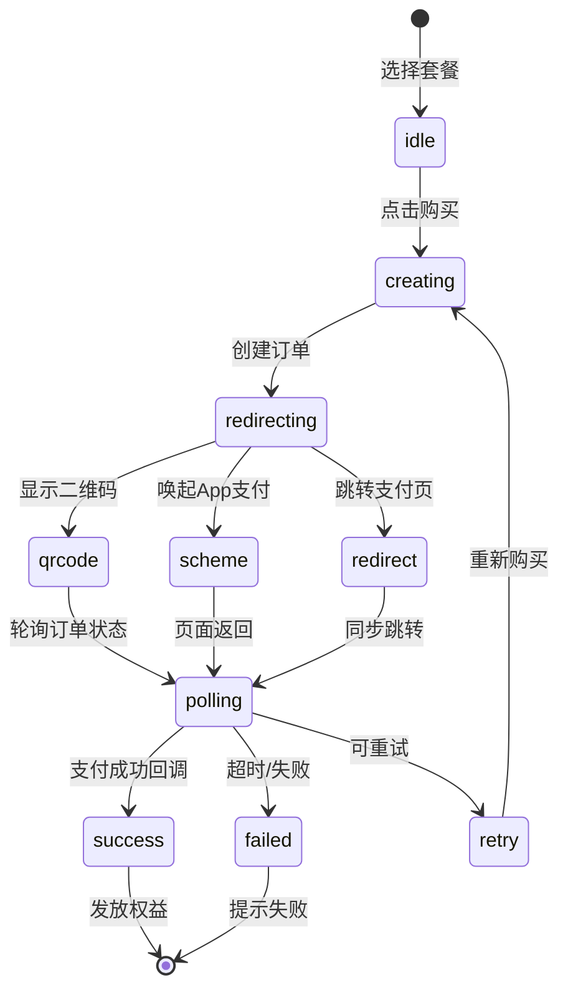

### 2.5 功能模块层次

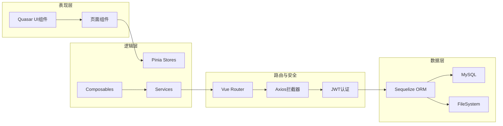

---

## 第三章 详细设计

### 3.1 界面设计

#### 3.1.1 典型使用流程

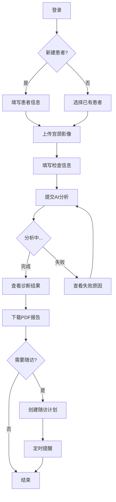

#### 3.1.2 核心界面概览

| 界面模块        | 功能描述                         | 核心组件                                     |
| --------------- | -------------------------------- | -------------------------------------------- |
| 🔐 **登录注册** | 多模式认证（邮箱/手机/AI验证码） | AuthSplitLayout, AliCaptcha, AgreementDialog |
| 📊 **仪表盘**   | 统计卡片、近期病例、快捷入口     | q-card, q-table, q-statistic                 |
| 👥 **患者管理** | 患者档案、搜索筛选、健康史       | PatientForm, PatientDetail, PatientSelector  |
| 📋 **病例中心** | 病例列表、Tab筛选、患者联动      | q-tabs, q-select, q-table                    |
| 📤 **影像上传** | 拖拽上传、批量操作、进度跟踪     | q-uploader, DatePicker                       |
| 🤖 **AI分析**   | 流式对话、深度思考、结果展示     | AIChatPanel, AnalysisCard, ECharts           |
| 📄 **报告查看** | PDF预览、下载、历史记录          | PdfViewer, ReportsPage                       |
| 💳 **订阅管理** | 套餐选择、支付流程、权益展示     | ApiSettingsPage, PaymentDialog               |
| 🔔 **通知中心** | 未读计数、通知列表、跳转联动     | NotificationBell, NotificationPanel          |
| 📅 **随访管理** | 计划创建、状态流转、提醒         | FollowUpsPage, Timeline                      |
| ⚙️ **偏好设置** | AI引擎、通知偏好、报告偏好       | AiPreferencesPage, SettingsPage              |

#### 3.1.3 AI对话面板特色

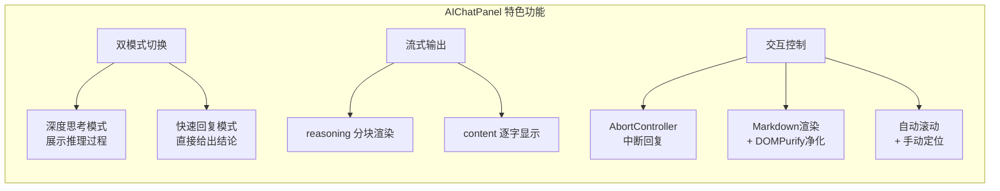

### 3.2 数据库设计

#### 3.2.1 核心数据表

| 表名               | 主要字段                                                     | 说明           |
| ------------------ | ------------------------------------------------------------ | -------------- |
| `users`            | id, email, phone, role, subscription_type, remaining_credits | 用户认证与订阅 |
| `patients`         | id, patient_id, name, gender, birth_date, medical_history    | 患者基本信息   |
| `studies`          | id, patient_id, status, priority, study_date                 | 病例记录       |
| `study_images`     | id, study_id, file_path, remote_url                          | 影像文件       |
| `analysis_tasks`   | id, study_id, status, started_at                             | AI分析任务     |
| `analysis_results` | id, task_id, classification, confidence                      | 分析结果       |
| `follow_ups`       | id, patient_id, planned_date, risk_level, status             | 随访计划       |
| `notifications`    | id, user_id, type, is_read                                   | 站内通知       |
| `orders`           | id, user_id, plan_type, status, money                        | 支付订单       |

#### 3.2.2 设计原则与权衡

| 设计决策     | 实现方式                         | 理由                             |
| ------------ | -------------------------------- | -------------------------------- |
| **软删除**   | paranoid mode + `deleted_at`     | 医疗数据需保留审计轨迹，支持恢复 |
| **字符集**   | utf8mb4                          | 支持emoji、多语言，避免中文乱码  |
| **连接池**   | max:20, min:5                    | 平衡并发性能与资源消耗           |
| **外键策略** | CASCADE update + RESTRICT delete | 防止误删保护引用完整性           |

### 3.3 关键技术创新

#### 痛点一：AI分析耗时长 → HTTP超时

**问题**：AI分析通常需要15-30秒，传统同步调用会导致HTTP超时。

**解决方案**：异步任务队列 + 前端轮询

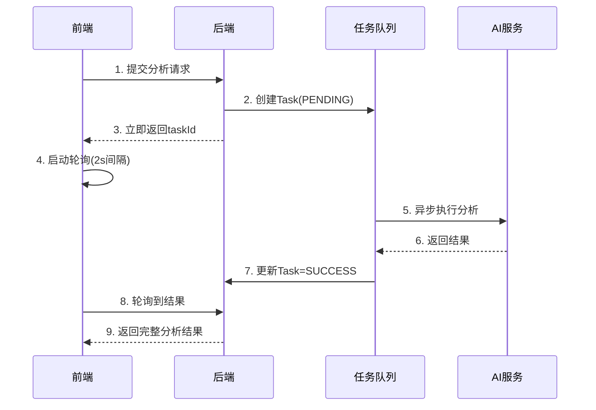

#### 痛点二：影像存储单点故障

**问题**：本地存储存在单点故障风险，不够可靠。

**解决方案**：双路径存储 + 图仓备份

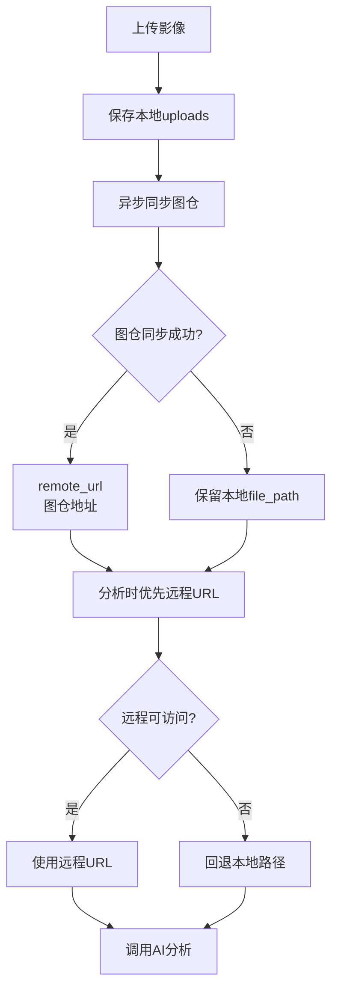

#### 痛点三：AI对话响应延迟与交互体验

**问题**：传统AI对话无法展示思考过程，医学场景需要可追溯的推理依据。

**解决方案**：流式对话 + 深度思考模式

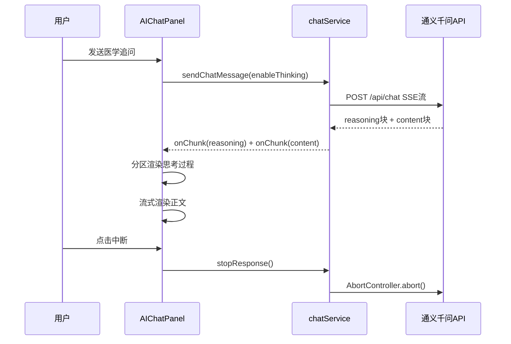

#### 技术亮点：JWT双Token刷新机制

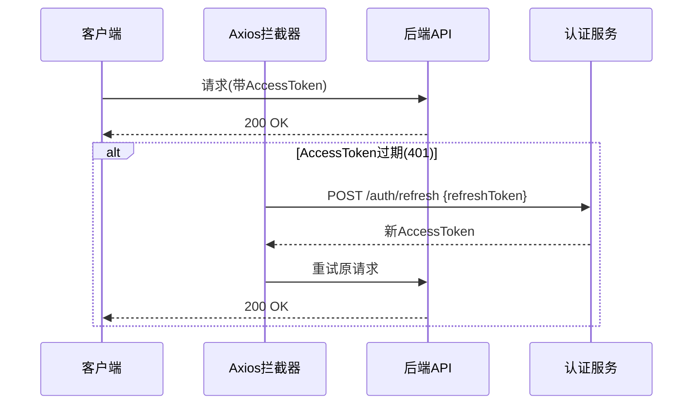

#### 技术亮点：支付签名安全

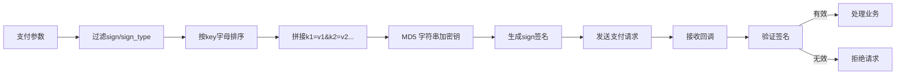

---

## 第四章 测试报告

### 4.1 测试用例与结果

| 测试类型       | 测试用例                                | 测试结果 |
| -------------- | --------------------------------------- | -------- |
| **功能测试**   | 邮箱登录/手机登录/AI验证码              | ✅ 通过  |
|                | 患者CRUD + 病例上传                     | ✅ 通过  |
|                | AI分析流程 + 结果展示                   | ✅ 通过  |
|                | PDF报告生成 + 下载                      | ✅ 通过  |
|                | 套餐订阅 + 易支付回调                   | ✅ 通过  |
|                | 随访计划 + 定时提醒                     | ✅ 通过  |
|                | 站内通知 + 未读计数                     | ✅ 通过  |
| **兼容性测试** | Chrome 115+ / Firefox 115+ / Safari 14+ | ✅ 通过  |
|                | iOS Safari / Android Chrome             | ✅ 通过  |
|                | 暗色模式 / 响应式布局                   | ✅ 通过  |
| **安全测试**   | SQL注入防护                             | ✅ 通过  |
|                | XSS攻击防护                             | ✅ 通过  |
|                | JWT Token有效性验证                     | ✅ 通过  |
|                | 文件上传类型/大小校验                   | ✅ 通过  |
|                | 支付回调MD5签名验证                     | ✅ 通过  |

### 4.2 技术指标

| 维度           | 指标            | 实测/说明             |
| -------------- | --------------- | --------------------- |
| **运行速度**   | API响应 < 300ms | 不含文件上传与AI分析  |
| **AI分析时长** | 单张 15-25秒    | 基于通义千问API       |
| **前端首屏**   | < 3秒           | 生产构建后            |
| **安全性**     | 多层防护        | JWT + 签名 + AI验证码 |
| **扩展性**     | 模块化架构      | 支持微服务化          |
| **部署方便性** | Docker + PM2    | 一键部署脚本          |
| **可用性**     | ≥ 99%           | 长期稳定运行          |
| **数据完整性** | 事务保护        | 软删除 + 审计轨迹     |

---

## 第五章 安装及使用

### 5.1 环境要求

| 环境     | 版本要求         | 说明             |
| -------- | ---------------- | ---------------- |
| Node.js  | ≥ 16.x (推荐20+) | 后端运行环境     |
| Bun/npm  | 最新稳定版       | 包管理           |
| MySQL    | 5.7 或 8.0       | 需支持utf8mb4    |
| 磁盘空间 | ≥ 1GB            | 含依赖与上传文件 |

### 5.2 安装步骤

```bash
# Step 1: 数据库创建
mysql -u root -p
CREATE DATABASE cervix_detect_ai CHARACTER SET utf8mb4 COLLATE utf8mb4_unicode_ci;
EXIT;

# Step 2: 安装依赖
bun install && cd server && bun install

# Step 3: 环境变量配置
cp .env.example .env          # 前端
cp server/.env.example server/.env  # 后端，编辑数据库连接

# Step 4: 数据库初始化
cd server && node scripts/init-database.js

# Step 5: 启动服务（分开两个终端）
bun run dev              # 前端 http://localhost:9000
cd server && bun run dev # 后端 http://localhost:3000
```

### 5.3 默认账号

```
管理员: admin@cervixdetectai.com / admin123456
```

### 5.4 典型使用流程

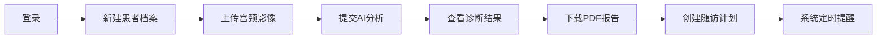

---

## 第六章 项目总结

### 6.1 项目协调

| 协作模式 | 具体实践                       |
| -------- | ------------------------------ |
| 开发方式 | 前后端分离，API文档驱动        |
| 版本控制 | Git + 规范提交信息             |
| 代码质量 | ESLint + Prettier + TypeScript |

### 6.2 克服的困难

| 困难             | 解决方案            | 技术收获     |
| ---------------- | ------------------- | ------------ |
| AI分析耗时长阻塞 | 异步队列 + 前端轮询 | 异步编程思维 |
| NAT网络支付回调  | EXTERNAL_PORT配置   | 网络穿透理解 |
| 影像存储单点故障 | 图仓异地备份        | 高可用设计   |
| 移动端适配       | Capacitor跨平台     | 响应式开发   |

### 6.3 技术成长

- **全栈工程化**：掌握Vue 3 + Node.js完整技术栈
- **SaaS架构设计**：多租户、订阅制、支付集成
- **医疗数据规范**：软删除、审计轨迹、权限控制

### 6.4 升级规划

| 版本 | 里程碑               | 优先级 |
| ---- | -------------------- | ------ |
| v2.0 | Docker容器化 + CI/CD | P1     |
| v2.1 | WebSocket实时推送    | P1     |
| v2.2 | 自研AI模型本地化     | P2     |
| v3.0 | 移动端原生应用       | P2     |

### 6.5 商业推广

- **目标市场**：基层医疗机构、县级医院、民营诊所
- **商业模式**：SaaS订阅 + 按次计费 + 企业定制
- **竞争优势**：低成本、高易用、全流程覆盖

---

## 参考文献

| 序号 | 文献名称                   | 来源/链接                             |
| ---- | -------------------------- | ------------------------------------- |
| 1    | Vue 3 官方文档             | https://vuejs.org/                    |
| 2    | Quasar Framework v2 文档   | https://quasar.dev/                   |
| 3    | Node.js 官方文档           | https://nodejs.org/                   |
| 4    | Express.js 框架文档        | https://expressjs.com/                |
| 5    | Sequelize ORM 文档         | https://sequelize.org/                |
| 6    | MySQL 8.0 参考手册         | https://dev.mysql.com/doc/refman/8.0/ |
| 7    | Pinia 状态管理文档         | https://pinia.vuejs.org/              |
| 8    | JWT (JSON Web Tokens) 标准 | https://jwt.io/                       |
| 9    | 阿里云短信服务文档         | https://help.aliyun.com/              |
| 10   | TypeScript 官方文档        | https://www.typescriptlang.org/       |

---

## 作品简介

CervixDetectAI 是一款面向基层医疗机构的宫颈癌AI辅助筛查SaaS云平台。系统提供患者管理、影像上传、AI分析、报告生成、随访管理全流程服务，支持按次/年订阅模式，降低基层医疗机构筛查门槛，助力宫颈癌早筛早诊。

---

## 创新描述

1. **异步队列解决AI超时**：采用异步任务队列+前端轮询机制，避免AI分析耗时导致的HTTP超时问题
2. **双路径存储高可用**：本地持久化+图仓异地备份双路径，分析时优先远程URL、失败自动回退
3. **流式AI对话交互**：支持"深度思考/快速回复"双模式，reasoning与content分块渲染，支持中断与Markdown安全净化
4. **多层安全防护**：JWT双Token认证+阿里云AI验证码+支付MD5签名验证，保障系统安全

---

<div align="center">

**— 文档结束 —**

_CervixDetectAI 研发团队 · 2026年4月_

</div>
