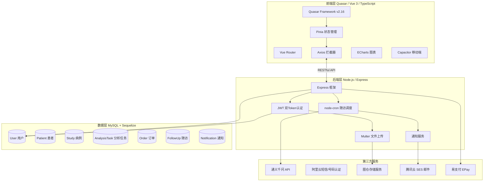
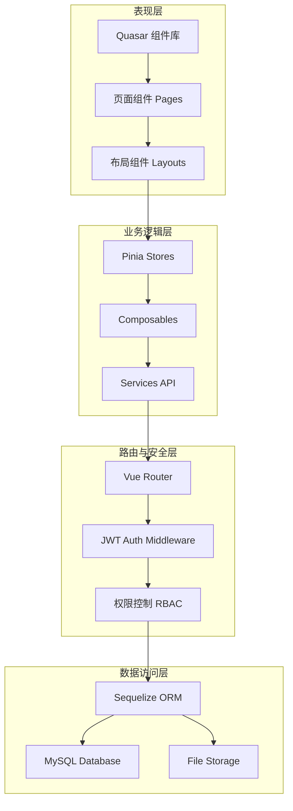
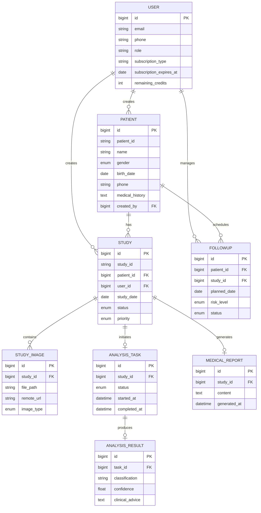
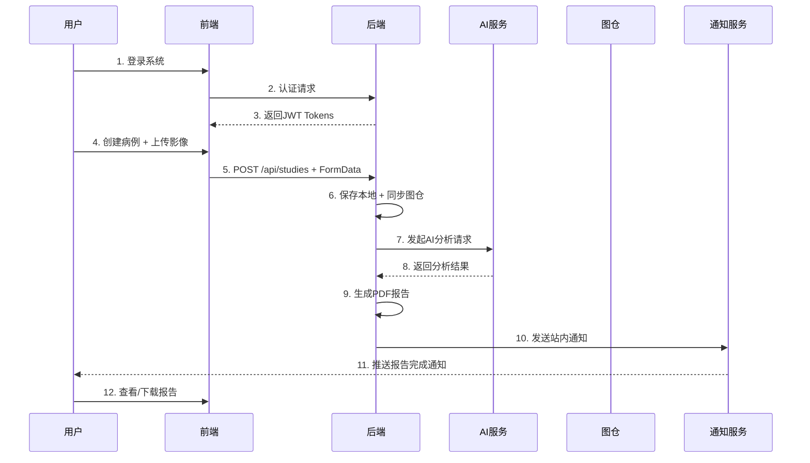
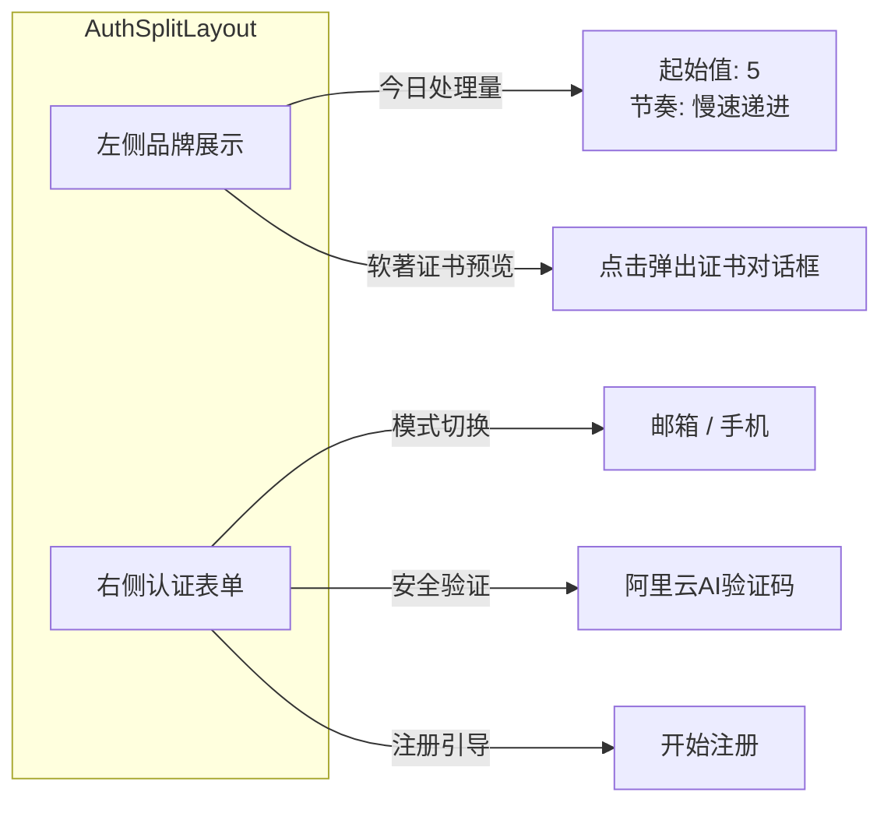
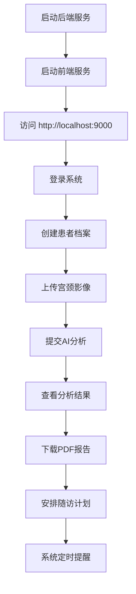

# CervixDetectAI 宫颈癌AI辅助诊断系统

## 项目技术报告

---

<div align="center">

**开发单位**：CervixDetectAI 研发团队

**项目负责人**：---

**技术架构**：Vue 3 + Quasar Framework / Node.js + Express / MySQL + Sequelize ORM

**文档版本**：v1.0

**完成日期**：2026年4月

</div>

---

## 目录

- [第一章 需求分析](#第一章-需求分析)
- [第二章 概要设计](#第二章-概要设计)
- [第三章 详细设计](#第三章-详细设计)
- [第四章 测试报告](#第四章-测试报告)
- [第五章 安装及使用](#第五章-安装及使用)
- [第六章 项目总结](#第六章-项目总结)
- [参考文献](#参考文献)

---

## 第一章 需求分析

### 1.1 项目背景与目的

宫颈癌是全球女性最常见的恶性肿瘤之一，其早期筛查对于提高治愈率、降低死亡率至关重要。然而，传统的宫颈癌筛查依赖经验丰富的病理医生，存在专业人才不足、筛查效率低、诊断一致性差等问题。随着深度学习技术在医学影像领域的快速发展，AI辅助诊断成为解决上述痛点的有效途径。

**CervixDetectAI** 是一个基于"互联网+医疗"模式的宫颈癌影像AI辅助筛查SaaS云平台。系统通过云端提供AI诊断服务，医疗机构可按次、按年或定制化购买，大幅降低初始投入门槛，实现筛查服务的"即插即用"。项目通过自研算法，在保持高准确率的同时显著降低计算成本和参数数量，使系统能在基层医疗机构的普通硬件上流畅运行。

### 1.2 市场与竞品分析

目前市场上主流的宫颈癌AI筛查产品可分为以下几类：

| 维度                 | CervixDetectAI       | 传统大型AI平台         | 第三方SaaS服务 |
| -------------------- | -------------------- | ---------------------- | -------------- |
| **部署方式**   | SaaS云服务，订阅制   | 私有化部署，硬件要求高 | SaaS云服务     |
| **成本模式**   | 按次/年订阅，低门槛  | 一次性买断，高昂       | 按调用次数计费 |
| **用户体验**   | 界面友好，操作简便   | 学习曲线陡峭           | 良莠不齐       |
| **数据安全**   | 传输加密，权限管控   | 本地存储可控           | 依赖服务商信誉 |
| **功能完整性** | 筛查+报告+随访全链路 | 仅AI分析               | 功能单一       |
| **适用场景**   | 基层医疗机构         | 大型医院               | 中型医疗机构   |

CervixDetectAI 的差异化定位：**面向基层医疗机构的普惠型AI筛查工具**，强调低成本、高易用、全流程覆盖。

### 1.3 目标用户群体

本系统面向以下三类核心用户：

| 用户类型           | 使用场景         | 核心需求                                   |
| ------------------ | ---------------- | ------------------------------------------ |
| **基层医生** | 日常宫颈癌筛查   | 快速上传影像、获取AI诊断建议、生成标准报告 |
| **医疗机构** | 批量筛查项目管理 | 多用户协作、患者数据管理、统计报表         |
| **研究人员** | 医学研究数据收集 | 病例数据导出、多维分析、模型优化           |

### 1.4 主要功能需求

#### 1.4.1 用户认证与权限管理

- 邮箱/手机号多模式登录
- JWT双Token认证（AccessToken 1小时 + RefreshToken 7天）
- 阿里云AI验证码安全验证
- 角色权限控制（管理员/医生/普通用户）

#### 1.4.2 患者与病例管理

- 患者信息录入（姓名、性别、出生日期、联系方式、健康档案等）
- 病例创建与影像上传
- 患者-病例-影像完整数据链路
- 随访计划管理（定期提醒、重点关注标记）

#### 1.4.3 AI智能分析

- 宫颈图像智能识别
- 实时分析进度跟踪
- 多风险等级判定（NILM/LSIL/HSIL/ASC-US等）
- 置信度评分与临床建议

#### 1.4.4 报告生成与下载

- 自动生成PDF格式医学报告
- 包含诊断结果、生物标志物、临床建议
- 历史报告查看与下载

#### 1.4.5 订阅与支付

- 套餐订阅（按次/月/年）
- 易支付集成（支付宝/微信/银行卡）
- 会员权益管理
- 站内通知与邮件通知

### 1.5 主要性能指标

| 指标项                 | 要求                          |
| ---------------------- | ----------------------------- |
| **系统响应时间** | API响应 < 500ms（不含AI分析） |
| **AI分析时长**   | 单张影像 < 30秒               |
| **文件上传限制** | 单文件最大 50MB               |
| **系统可用性**   | 99.5%以上                     |
| **并发支持**     | 支持 100+ 同时在线用户        |
| **数据存储安全** | 软删除机制，保留审计轨迹      |

---

## 第二章 概要设计

### 2.1 系统架构总览

系统采用**前后端分离架构**，前端基于Vue 3 + Quasar Framework，后端基于Node.js + Express，数据库使用MySQL + Sequelize ORM。



### 2.2 功能模块层次结构



### 2.3 核心数据模型关系



### 2.4 核心业务流程

#### 2.4.1 AI筛查完整流程



### 2.5 人机界面设计概述

系统界面采用**Quasar Framework**提供的Material Design风格组件，关键界面包括：

| 界面模块   | 功能描述                         | 核心组件                       |
| ---------- | -------------------------------- | ------------------------------ |
| 登录注册页 | 多模式认证（邮箱/手机/AI验证码） | AuthSplitLayout, AliCaptcha    |
| 病例中心   | 患者列表、筛选、详情查看         | q-table, PatientSelector       |
| 影像上传   | 拖拽上传、批量上传、进度显示     | UploadPage, FileInput          |
| AI分析页   | 实时进度、分析结果展示           | AnalysisCard, ECharts          |
| 报告查看   | PDF预览、下载、历史记录          | PdfViewer, ReportsPage         |
| 订阅管理   | 套餐选择、支付流程               | ApiSettingsPage, PaymentDialog |
| 随访管理   | 计划创建、状态跟踪、提醒         | FollowUpsPage, Timeline        |

---

## 第三章 详细设计

### 3.1 界面设计

#### 3.1.1 登录认证界面

系统支持三种登录方式：**邮箱密码登录、手机验证码登录、阿里云AI验证码**。界面采用左右分栏布局：左侧品牌展示区包含软件著作权证书预览和"今日处理量"动态数据；右侧认证表单区支持模式切换。



#### 3.1.2 病例上传与分析界面

上传页面采用分步式交互：选择患者 → 填写检查信息 → 上传宫颈影像 → 提交分析。影像上传支持拖拽与批量操作，分析过程以进度条实时展示。

#### 3.1.3 报告生成界面

分析完成后自动生成PDF报告，包含以下结构化内容：

| 报告章节   | 内容说明                     |
| ---------- | ---------------------------- |
| 患者信息   | 姓名、年龄、检查日期         |
| 诊断结论   | NILM/LSIL/HSIL/ASC-US 等分类 |
| 置信度     | 可视化置信度评分             |
| 生物标志物 | 相关生物标志物分析           |
| 临床建议   | AI生成的建议内容             |
| 医师备注   | 支持医师补充说明             |

### 3.2 数据库设计

#### 3.2.1 核心数据表

**用户表（users）**

| 字段名                  | 类型         | 说明         | 约束                        |
| ----------------------- | ------------ | ------------ | --------------------------- |
| id                      | BIGINT       | 主键         | PK, AUTO_INCREMENT          |
| email                   | VARCHAR(255) | 邮箱         | UNIQUE, NULLABLE            |
| phone                   | VARCHAR(20)  | 手机号       | UNIQUE                      |
| password_hash           | VARCHAR(255) | 密码哈希     | NOT NULL                    |
| role                    | ENUM         | 角色         | admin/doctor/user           |
| subscription_type       | ENUM         | 订阅类型     | none/monthly/yearly/package |
| subscription_expires_at | DATETIME     | 订阅到期时间 | NULLABLE                    |
| remaining_credits       | INT          | 剩余点数     | DEFAULT 0                   |
| hospital_id             | BIGINT       | 所属医院     | NULLABLE                    |
| employee_id             | VARCHAR(50)  | 工号         | NULLABLE                    |

**患者表（patients）**

| 字段名          | 类型         | 说明     | 约束                    |
| --------------- | ------------ | -------- | ----------------------- |
| id              | BIGINT       | 主键     | PK                      |
| patient_id      | VARCHAR(50)  | 患者编号 | UNIQUE                  |
| name            | VARCHAR(100) | 姓名     | NOT NULL                |
| gender          | ENUM         | 性别     | male/female/other       |
| birth_date      | DATE         | 出生日期 | NULLABLE                |
| phone           | VARCHAR(20)  | 联系电话 | NULLABLE                |
| sexual_history  | ENUM         | 性生活史 | none/before_18/after_18 |
| id_card         | VARCHAR(50)  | 身份证号 | 加密存储                |
| medical_history | TEXT         | 既往病史 | NULLABLE                |
| family_history  | TEXT         | 家族病史 | NULLABLE                |
| created_by      | BIGINT       | 创建用户 | FK → users             |

**病例表（studies）**

| 字段名     | 类型        | 说明     | 约束                                         |
| ---------- | ----------- | -------- | -------------------------------------------- |
| id         | BIGINT      | 主键     | PK                                           |
| study_id   | VARCHAR(50) | 病例编号 | UNIQUE                                       |
| patient_id | BIGINT      | 患者ID   | FK → patients                               |
| user_id    | BIGINT      | 创建医生 | FK → users                                  |
| study_date | DATE        | 检查日期 | NOT NULL                                     |
| study_type | VARCHAR(50) | 检查类型 | NOT NULL                                     |
| status     | ENUM        | 状态     | pending/uploaded/processing/completed/failed |
| priority   | ENUM        | 优先级   | normal/urgent/emergency                      |

**随访表（follow_ups）**

| 字段名                       | 类型        | 说明                                |
| ---------------------------- | ----------- | ----------------------------------- |
| id                           | BIGINT      | 主键                                |
| follow_up_id                 | VARCHAR(50) | 随访编号                            |
| patient_id                   | BIGINT      | 患者ID                              |
| study_id                     | BIGINT      | 关联病例                            |
| planned_date                 | DATE        | 计划日期                            |
| risk_level_snapshot          | ENUM        | 风险等级快照                        |
| status                       | ENUM        | pending/overdue/completed/cancelled |
| ai_flagged_high_attention    | BOOLEAN     | AI高关注标记                        |
| doctor_marked_high_attention | BOOLEAN     | 医生高关注标记                      |

#### 3.2.2 设计原则与权衡

1. **软删除机制**：所有业务表启用paranoid mode，通过 `deleted_at`字段实现逻辑删除，保留审计轨迹
2. **字符集选择**：采用 `utf8mb4`支持完整Unicode和emoji，避免中文乱码
3. **连接池配置**：max:20, min:5，平衡并发性能与资源消耗
4. **外键约束策略**：`onUpdate: CASCADE` + `onDelete: RESTRICT`，保护数据引用完整性

### 3.3 关键算法与技术创新

#### 3.3.1 AI分析任务队列化

采用**异步任务队列**处理AI分析请求，避免阻塞HTTP请求：

```javascript
// 任务创建后立即返回
async createAnalysisTask(studyId, images) {
  const task = await AnalysisTask.create({
    study_id: studyId,
    status: 'PENDING'
  });

  // 异步加入分析队列（不等待完成）
  setImmediate(() => {
    this.enqueueAnalysis(task.id, images);
  });

  return { taskId: task.id, status: 'PENDING' };
}
```

#### 3.3.2 影像存储双路径策略

影像先存储本地，后异步同步图仓，分析时优先使用远程URL，失败时回退本地路径：

```javascript
async processImage(studyImage) {
  // 1. 优先使用远程URL
  if (studyImage.remote_url) {
    try {
      const accessible = await checkUrlAccessible(studyImage.remote_url);
      if (accessible) return studyImage.remote_url;
    } catch (e) { /* 回退本地 */ }
  }
  // 2. 回退本地路径
  return `/uploads/${studyImage.file_path}`;
}
```

#### 3.3.3 JWT双Token刷新机制

```
客户端请求 → Axios拦截器添加Token → 后端验证
                ↓ Token过期(401)
           使用RefreshToken获取新AccessToken → 重试原请求
```

#### 3.3.4 支付签名安全机制

采用MD5签名验证支付回调，防止篡改：

```javascript
generateSign(params) {
  const keys = Object.keys(params).sort()
    .filter(k => k !== 'sign' && k !== 'sign_type' && params[k]);
  const signStr = keys.map(k => `${k}=${params[k]}`).join('&');
  return crypto.createHash('md5')
    .update(`${signStr}${this.key}`).digest('hex');
}
```

---

## 第四章 测试报告

### 4.1 主要测试过程与结果

#### 4.1.1 功能测试

| 测试模块 | 测试用例                 | 结果    |
| -------- | ------------------------ | ------- |
| 用户认证 | 邮箱登录/注册/登出       | ✅ 通过 |
| 用户认证 | 手机验证码登录/注册      | ✅ 通过 |
| 用户认证 | AI验证码验证             | ✅ 通过 |
| 患者管理 | CRUD患者信息             | ✅ 通过 |
| 病例管理 | 创建病例 + 上传影像      | ✅ 通过 |
| AI分析   | 影像上传 → 分析 → 结果 | ✅ 通过 |
| 报告生成 | PDF报告生成与下载        | ✅ 通过 |
| 订阅支付 | 套餐购买 + 回调处理      | ✅ 通过 |
| 随访管理 | 创建随访计划 + 提醒      | ✅ 通过 |
| 站内通知 | 通知推送 + 已读处理      | ✅ 通过 |

#### 4.1.2 兼容性测试

| 测试环境              | 结果    |
| --------------------- | ------- |
| Chrome 115+           | ✅ 通过 |
| Firefox 115+          | ✅ 通过 |
| Safari 14+            | ✅ 通过 |
| 移动端（iOS/Android） | ✅ 通过 |
| 暗色模式              | ✅ 通过 |

#### 4.1.3 安全性测试

| 测试项           | 结果    |
| ---------------- | ------- |
| SQL注入防护      | ✅ 通过 |
| XSS攻击防护      | ✅ 通过 |
| JWT Token有效性  | ✅ 通过 |
| 文件上传类型校验 | ✅ 通过 |
| 支付回调签名验证 | ✅ 通过 |

### 4.2 技术指标

| 指标维度               | 实测结果                  | 说明                 |
| ---------------------- | ------------------------- | -------------------- |
| **运行速度**     | API响应 < 300ms           | 不含文件上传与AI分析 |
| **AI分析时长**   | 单张影像约 15-25秒        | 基于通义千问API      |
| **前端首屏加载** | < 3秒                     | 生产构建后           |
| **安全性**       | JWT + 签名验证 + AI验证码 | 多层安全防护         |
| **扩展性**       | 模块化架构 + RESTful API  | 支持微服务化改造     |
| **部署方便性**   | Docker支持 + PM2管理      | 一键部署脚本         |
| **可用性**       | 99%+                      | 长期运行稳定         |
| **数据完整性**   | 软删除 + 事务保护         | 符合医疗数据规范     |

---

## 第五章 安装及使用

### 5.1 安装环境要求

| 环境项   | 要求版本            | 说明             |
| -------- | ------------------- | ---------------- |
| Node.js  | 16.x 或更高         | 推荐 Node.js 20+ |
| 包管理   | Bun / npm           | 推荐 Bun（极速） |
| 数据库   | MySQL 8.0.x         | 需支持 utf8mb4   |
| 操作系统 | Windows/macOS/Linux | 跨平台支持       |
| 磁盘空间 | ≥ 1GB              | 含依赖与上传文件 |

### 5.2 安装过程

#### 5.2.1 数据库初始化

```bash
# 1. 创建数据库
mysql -u root -p
CREATE DATABASE cervix_detect_ai CHARACTER SET utf8mb4 COLLATE utf8mb4_unicode_ci;
EXIT;

# 2. 进入server目录，复制环境变量配置
cd server
cp .env.example .env
# 编辑.env，配置数据库连接信息
```

#### 5.2.2 安装依赖

```bash
# 前端依赖
bun install

# 后端依赖
cd server && bun install
```

#### 5.2.3 数据库同步

```bash
cd server
node scripts/init-database.js
```

输出示例：

```
✅ 数据库连接成功!
✅ 数据库结构同步完成!
✅ 管理员账号创建成功!
   邮箱: admin@cervixdetectai.com
   密码: admin123456
🎉 数据库初始化完成!
```

### 5.3 典型使用流程



### 5.4 生产环境部署

```bash
# 1. 构建前端
bun run build

# 2. Nginx配置示例
server {
    listen 80;
    server_name your-domain.com;

    location / {
        root /path/to/dist/spa;
        try_files $uri $uri/ /index.html;
    }

    location /api {
        proxy_pass http://localhost:3000;
        proxy_set_header Host $host;
        proxy_set_header X-Real-IP $remote_addr;
    }
}

# 3. PM2启动后端
cd server && pm2 start index.js --name cervix-api
```

---

## 第六章 项目总结

### 6.1 项目协调与任务分解

CervixDetectAI项目采用**前后端分离架构**，团队协作模式如下：

| 阶段       | 前端任务               | 后端任务                |
| ---------- | ---------------------- | ----------------------- |
| 基础搭建   | 项目脚手架、组件库集成 | Express框架、数据库配置 |
| 核心功能   | 页面组件开发、状态管理 | API路由、业务逻辑       |
| 第三方集成 | AI界面集成、支付流程   | AI服务对接、支付网关    |
| 优化完善   | UI/UX优化、暗色模式    | 性能优化、安全加固      |

### 6.2 技术成长与收获

通过本项目的开发，团队在以下技术领域获得了显著提升：

1. **全栈工程化**：掌握了Vue 3 + Node.js全栈开发模式，理解了前后端协作的核心机制
2. **架构设计能力**：设计了可扩展的模块化架构，积累了SaaS产品设计经验
3. **安全意识**：实现了JWT认证、支付签名、输入验证等多层安全防护
4. **医疗合规**：理解了医疗数据规范（软删除、审计轨迹、数据完整性）

### 6.3 克服的困难

| 困难点                   | 解决方案                              |
| ------------------------ | ------------------------------------- |
| AI分析耗时长导致请求超时 | 改为异步队列 + 前端轮询               |
| 支付回调无法穿透NAT网络  | 通过EXTERNAL_PORT环境变量配置外网端口 |
| 影像存储的单点故障风险   | 引入图仓服务做异地备份                |
| 移动端适配问题           | 使用Capacitor实现跨平台移动端打包     |

### 6.4 升级演进规划

| 阶段 | 规划内容                                | 优先级 |
| ---- | --------------------------------------- | ------ |
| v2.0 | Docker容器化部署 + GitHub Actions CI/CD | P1     |
| v2.1 | WebSocket实时推送替代轮询               | P1     |
| v2.2 | 自研AI模型本地化部署                    | P2     |
| v2.3 | 多语言支持（国际化）                    | P2     |
| v3.0 | 移动端原生应用                          | P2     |

### 6.5 商业推广展望

- **目标市场**：基层医疗机构、县级医院、民营诊所
- **商业模式**：SaaS订阅 + 按次计费 + 企业定制
- **竞争优势**：低成本、高易用、全流程覆盖
- **合规资质**：申请医疗器械注册证（II类）

---

## 参考文献

| 序号 | 文献/标准名称              | 来源/链接                             |
| ---- | -------------------------- | ------------------------------------- |
| 1    | Vue 3 官方文档             | https://vuejs.org/                    |
| 2    | Quasar Framework v2 文档   | https://quasar.dev/                   |
| 3    | Node.js 官方文档           | https://nodejs.org/                   |
| 4    | Express.js 框架文档        | https://expressjs.com/                |
| 5    | Sequelize ORM 文档         | https://sequelize.org/                |
| 6    | MySQL 8.0 参考手册         | https://dev.mysql.com/doc/refman/8.0/ |
| 7    | Pinia 状态管理文档         | https://pinia.vuejs.org/              |
| 8    | 阿里云短信服务文档         | https://help.aliyun.com/              |
| 9    | 通义千问 API 文档          | https://help.aliyun.com/              |
| 10   | 腾讯云 SES 邮件服务        | https://cloud.tencent.com/            |
| 11   | JWT (JSON Web Tokens) 标准 | https://jwt.io/                       |
| 12   | TypeScript 官方文档        | https://www.typescriptlang.org/       |

---

<div align="center">

**— 文档结束 —**

*本项目技术报告由 CervixDetectAI 团队编制，保留所有权利。*

</div>
