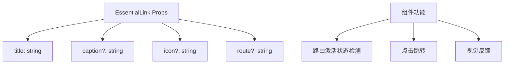
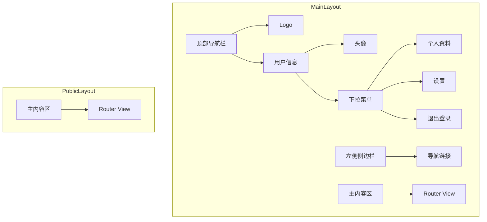
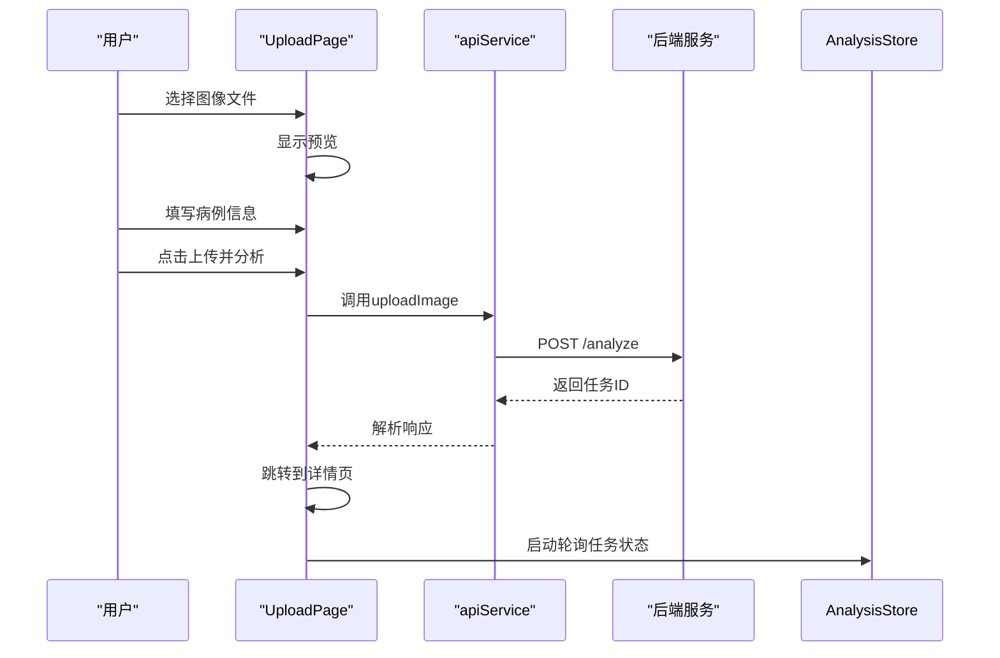
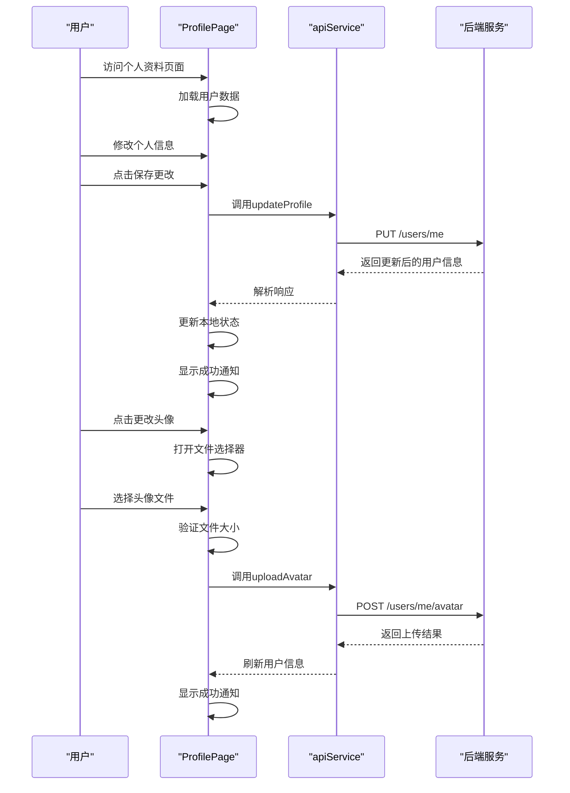
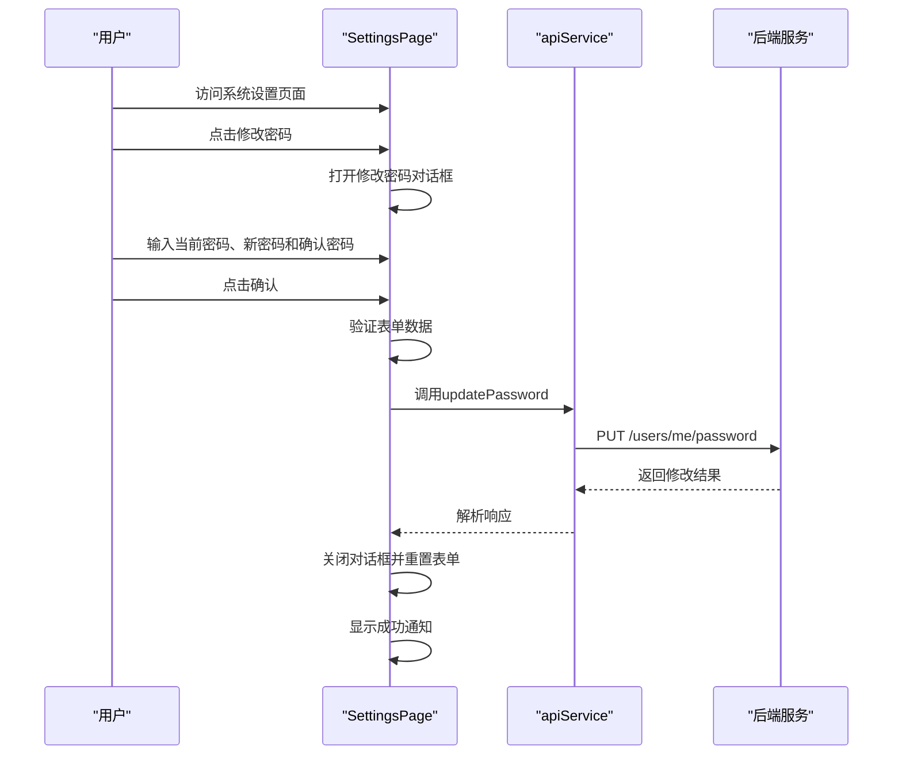
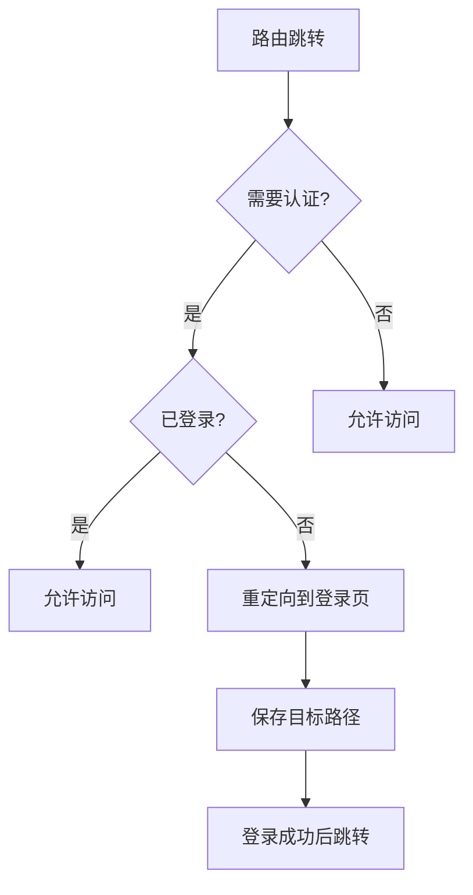
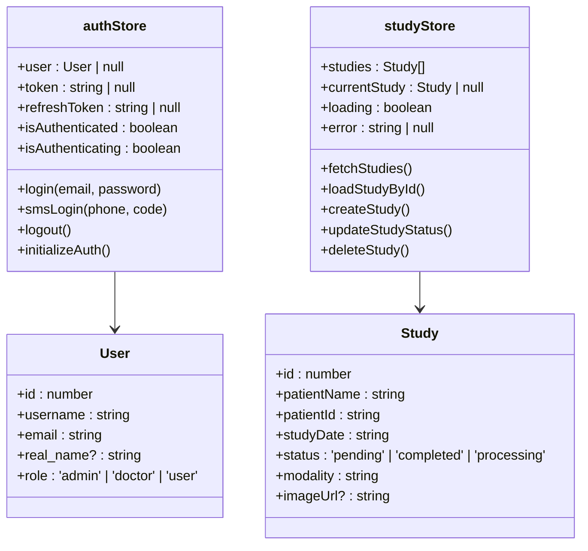
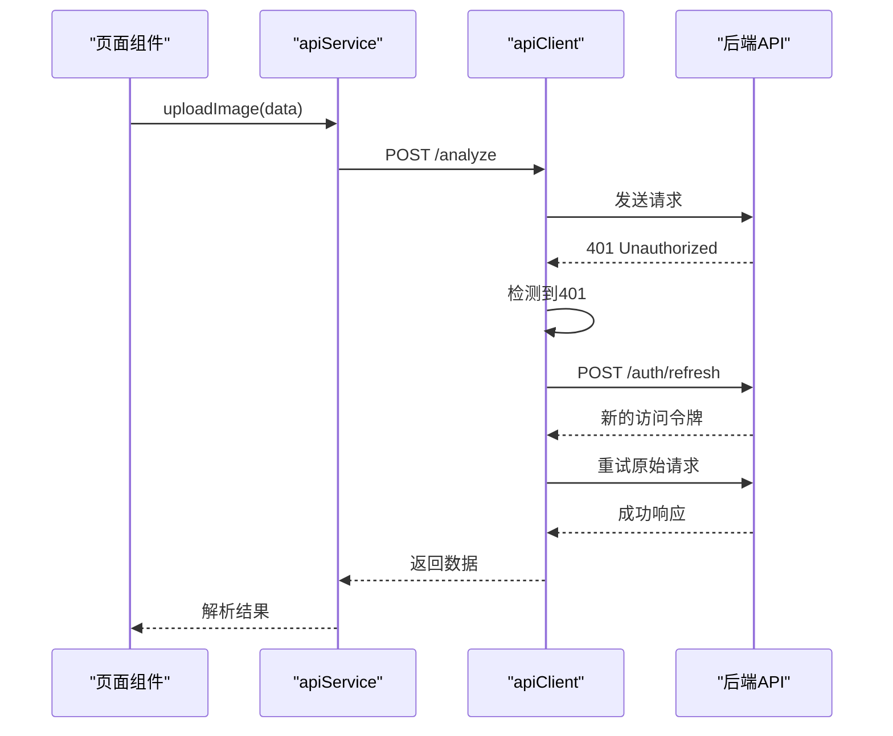

# 前端目录结构

> **本文档中引用的文件**  
> - [EssentialLink.vue](file://src/components/EssentialLink.vue)
> - [MainLayout.vue](file://src/layouts/MainLayout.vue)
> - [PublicLayout.vue](file://src/layouts/PublicLayout.vue)
> - [LoginPage.vue](file://src/pages/LoginPage.vue)
> - [RegisterPage.vue](file://src/pages/RegisterPage.vue)
> - [UploadPage.vue](file://src/pages/UploadPage.vue)
> - [routes.ts](file://src/router/routes.ts)
> - [index.ts](file://src/router/index.ts)
> - [authStore.ts](file://src/stores/authStore.ts)
> - [studyStore.ts](file://src/stores/studyStore.ts)
> - [apiService.ts](file://src/services/apiService.ts)
> - [api.ts](file://src/services/api.ts)
> - [App.vue](file://src/App.vue)
> - [logo.svg](file://public/logo.svg)
> - [ProfilePage.vue](file://src/pages/ProfilePage.vue) - *更新了现代化UI设计、实时个人资料更新和头像上传功能*
> - [SettingsPage.vue](file://src/pages/SettingsPage.vue) - *增强了异步提交和表单验证功能*

## 更新摘要
**变更内容**   
- 更新了“页面组件职责”部分，新增对ProfilePage.vue和SettingsPage.vue的详细说明
- 添加了ProfilePage的现代化UI设计、实时个人资料更新和头像上传功能的实现细节
- 增加了SettingsPage的异步提交和表单验证机制的说明
- 更新了相关文件的引用来源，标记了修改状态

## 目录

1. [项目结构概览](#项目结构概览)
2. [可复用UI组件设计](#可复用ui组件设计)
3. [布局组件分析](#布局组件分析)
4. [页面组件职责](#页面组件职责)
5. [路由配置与导航守卫](#路由配置与导航守卫)
6. [状态管理模块](#状态管理模块)
7. [API服务封装](#api服务封装)
8. [模块协作关系](#模块协作关系)

## 项目结构概览

本项目采用基于Quasar框架的Vue 3 + TypeScript架构，src目录下包含核心前端代码。主要目录结构包括：
- **components**: 存放可复用的UI组件
- **layouts**: 布局组件，定义页面整体结构
- **pages**: 页面级组件，对应不同路由视图
- **router**: 路由配置，包含路由定义和导航守卫
- **stores**: Pinia状态管理模块
- **services**: API服务封装，处理与后端通信

**Section sources**
- [App.vue](file://src/App.vue#L1-L16)

## 可复用UI组件设计

### EssentialLink组件

`EssentialLink.vue`是一个可复用的导航链接组件，主要用于侧边栏菜单项。该组件通过props接收标题、描述、图标和路由信息，实现了统一的菜单项样式和交互逻辑。

组件特点：
- 使用`q-item`作为基础元素，支持点击跳转
- 通过`active-class`实现选中状态高亮
- 支持图标和多行文本展示
- 利用`computed`属性动态判断当前路由激活状态

该组件在MainLayout中被循环渲染，构建出完整的导航菜单体系。

**Section sources**
- [EssentialLink.vue](file://src/components/EssentialLink.vue#L1-L43)

## 布局组件分析

### MainLayout布局

`MainLayout.vue`是应用的主要布局组件，为需要认证的页面提供统一的界面框架。包含顶部导航栏、左侧侧边栏和主内容区域。

主要特性：
- 顶部导航栏显示应用logo和用户信息
- 用户信息区域包含头像、姓名和下拉菜单
- 左侧侧边栏提供主要导航链接
- 集成Quasar UI组件实现现代化设计
- 统一使用`/logo.svg`作为品牌标识

布局逻辑：
- 通过`useAuthStore`访问用户认证状态
- 动态显示用户姓名或首字母缩写
- 提供登出功能
- 包含通知中心入口

### PublicLayout布局

`PublicLayout.vue`是公共布局组件，用于登录、注册等无需认证的页面。该布局极为简洁，仅包含基本的页面容器，不包含侧边栏和复杂导航。

设计目的：
- 为认证相关页面提供极简界面
- 减少用户在登录流程中的干扰
- 保持品牌一致性的同时简化界面
- 统一使用`/logo.svg`作为品牌标识

**Section sources**
- [MainLayout.vue](file://src/layouts/MainLayout.vue#L1-L211)
- [PublicLayout.vue](file://src/layouts/PublicLayout.vue#L1-L16)

## 页面组件职责

### LoginPage页面

`LoginPage.vue`负责用户认证功能，支持两种登录方式：邮箱密码登录和手机验证码登录。

功能特点：
- 提供标签页切换不同登录方式
- 包含表单验证逻辑
- 显示加载状态
- 集成记住我功能
- 支持忘记密码流程
- 在页面顶部居中展示`/logo.svg`品牌标识
- 显示应用名称和标语，增强品牌识别

手机验证码登录流程：
1. 输入手机号
2. 获取验证码（倒计时控制）
3. 输入验证码
4. 自动判断登录或注册

### RegisterPage页面

`RegisterPage.vue`用于新用户注册，提供完整的注册表单。

页面特性：
- 包含邮箱、密码、确认密码等必填字段
- 支持姓名、手机号等可选信息收集
- 实现密码强度验证和一致性检查
- 在页面顶部居中展示`/logo.svg`品牌标识
- 显示应用名称和标语，增强品牌识别
- 提供登录跳转链接，方便已有用户操作

### UploadPage页面

`UploadPage.vue`用于上传新的医疗影像病例，是核心功能页面之一。

页面结构：
- 左侧：文件上传区域
- 右侧：病例信息表单

主要功能：
- 支持图像文件上传和预览
- 验证文件格式和大小
- 收集患者基本信息
- 提交后触发AI分析流程
- 集成通知系统反馈操作结果

### ProfilePage页面

`ProfilePage.vue`经过重大更新，实现了现代化的UI设计、实时个人资料更新和功能性的头像上传功能。

页面结构：
- 左侧：用户概览卡片（包含头像、基本信息和统计信息）
- 右侧：详细信息编辑表单

主要功能增强：
- **现代化UI设计**：采用卡片式布局，增加阴影和悬停效果，提升视觉体验
- **实时个人资料更新**：通过`profileData`响应式对象管理表单数据，支持实时编辑和保存
- **头像上传功能**：实现完整的头像上传流程，包括文件选择、大小验证和上传处理

数据流设计：
- 通过`useAuthStore`获取当前用户信息
- 使用`userAPI.getProfile()`获取完整个人资料
- 表单修改后通过`userAPI.updateProfile()`保存更改
- 头像上传通过`userAPI.uploadAvatar()`处理，并自动刷新用户信息

关键代码实现：
- `avatarUrl`计算属性处理头像URL的环境适配
- `saveProfile`方法实现表单数据的异步保存
- `uploadAvatar`方法处理文件上传和验证逻辑
- `resetForm`方法提供表单重置功能

**Section sources**
- [ProfilePage.vue](file://src/pages/ProfilePage.vue#L1-L549) - *更新了现代化UI设计、实时个人资料更新和头像上传功能*

### SettingsPage页面

`SettingsPage.vue`经过增强，加入了异步提交和表单验证功能。

页面结构：
- 左侧：通知偏好设置表单
- 右侧：用户信息卡片和应用信息卡片

主要功能增强：
- **异步提交**：所有表单提交操作都采用异步处理，显示加载状态
- **表单验证**：在修改密码对话框中实现了完整的表单验证逻辑
- **用户体验优化**：添加了各种状态通知，提升用户交互体验

关键功能实现：
- **通知偏好设置**：通过`notificationForm`管理通知设置，支持即时保存
- **修改密码功能**：在对话框中实现完整的密码修改流程，包含：
  - 当前密码、新密码和确认密码的输入验证
  - 新旧密码一致性检查
  - 密码长度验证（至少6位）
  - 异步提交和加载状态显示
- **隐私设置**：提供数据共享、分析使用和双因素认证等隐私选项

代码实现特点：
- 使用`changingPassword`状态管理加载状态
- 在`changePassword`方法中实现多层验证逻辑
- 通过`$q.notify`提供各种操作反馈
- 使用`v-close-popup`自动关闭对话框

**Section sources**
- [SettingsPage.vue](file://src/pages/SettingsPage.vue#L1-L357) - *增强了异步提交和表单验证功能*

## 路由配置与导航守卫

### 路由组织方式

`routes.ts`文件定义了应用的路由结构，采用嵌套路由模式：

- 根路径使用`PublicLayout`
- `/app`路径使用`MainLayout`并标记需要认证
- 通配符路由处理404页面

路由特点：
- 按功能模块组织
- 使用命名路由便于引用
- 包含动态路由参数（如`/studies/:id`）
- 设置路由元信息（meta.requiresAuth）

### 导航守卫机制

`index.ts`中的全局前置守卫确保只有认证用户才能访问受保护的路由。

守卫逻辑：
1. 检查目标路由是否需要认证
2. 若需要认证且用户未登录，则重定向到登录页
3. 保存原始目标路径用于登录后跳转
4. 允许公共路由直接访问

这种机制实现了无缝的权限控制，确保了应用的安全性。

**Section sources**
- [routes.ts](file://src/router/routes.ts#L1-L72)
- [index.ts](file://src/router/index.ts#L1-L62)

## 状态管理模块

### authStore认证状态

`authStore.ts`管理用户认证相关状态，是应用的核心状态模块之一。

状态属性：
- `user`: 当前用户信息
- `token`: 访问令牌
- `refreshToken`: 刷新令牌
- `isAuthenticated`: 认证状态
- `isAuthenticating`: 认证进行中状态

主要操作：
- `login`: 邮箱密码登录
- `smsLogin`: 手机验证码登录
- `logout`: 退出登录
- `initializeAuth`: 从localStorage初始化状态

持久化策略：
- 使用localStorage存储令牌和用户信息
- 应用启动时自动恢复认证状态
- 登出时清除所有存储数据

### studyStore病例状态

`studyStore.ts`管理医疗影像病例的状态和操作。

状态属性：
- `studies`: 病例列表
- `currentStudy`: 当前选中的病例
- `loading`: 加载状态
- `error`: 错误信息

核心功能：
- 获取病例列表
- 加载单个病例详情
- 创建新病例
- 更新病例状态
- 删除病例

数据流设计：
- 从API获取数据并转换为前端格式
- 维护本地状态与服务器同步
- 提供计算属性简化数据访问

**Section sources**
- [authStore.ts](file://src/stores/authStore.ts#L1-L219)
- [studyStore.ts](file://src/stores/studyStore.ts#L1-L267)

## API服务封装

### apiService封装策略

`apiService.ts`提供了对API请求的高级封装，特别是针对文件上传和任务轮询的复杂场景。

主要功能：
- `uploadImage`: 上传图像并创建分析任务
- `getTaskStatus`: 查询任务状态
- `getStudyAnalysis`: 获取分析结果
- `pollTaskStatus`: 轮询任务状态直到完成

封装特点：
- 使用FormData处理文件上传
- 提供详细的日志输出
- 实现任务轮询机制
- 定义清晰的接口类型

### axios实例配置

`api.ts`文件配置了axios实例，处理所有API请求。

配置要点：
- 设置基础URL
- 添加认证令牌到请求头
- 实现刷新令牌机制
- 统一错误处理

拦截器功能：
- 请求拦截器：添加认证令牌
- 响应拦截器：处理401错误并尝试刷新令牌
- 自动重试机制

当检测到令牌过期时，自动使用刷新令牌获取新访问令牌，并重试原始请求，提升了用户体验。

**Section sources**
- [apiService.ts](file://src/services/apiService.ts#L1-L198)
- [api.ts](file://src/services/api.ts#L1-L335)

## 模块协作关系

各模块通过清晰的依赖关系协同工作，形成完整的应用架构。

核心协作流程：
1. 用户通过页面组件触发操作
2. 组件调用服务层API
3. 服务层处理请求并返回数据
4. 状态管理模块更新状态
5. 组件响应状态变化更新UI

初始化流程：
- App.vue在挂载时初始化认证状态
- 路由守卫检查认证状态
- 布局组件根据状态显示相应内容
- 页面组件加载时获取必要数据

数据流特点：
- 单向数据流确保可预测性
- 状态集中管理便于调试
- 服务层抽象API细节
- 组件专注于UI展示

这种架构设计实现了关注点分离，提高了代码的可维护性和可扩展性。

**Section sources**
- [App.vue](file://src/App.vue#L1-L16)