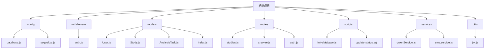
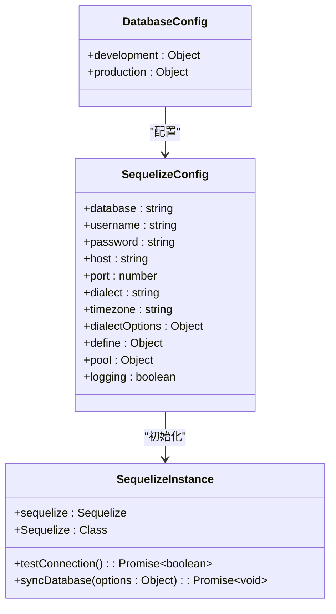
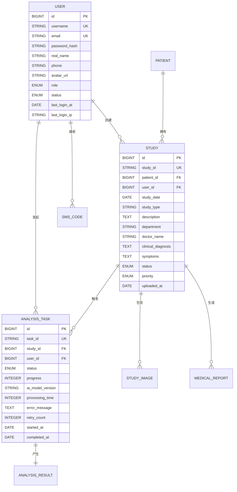
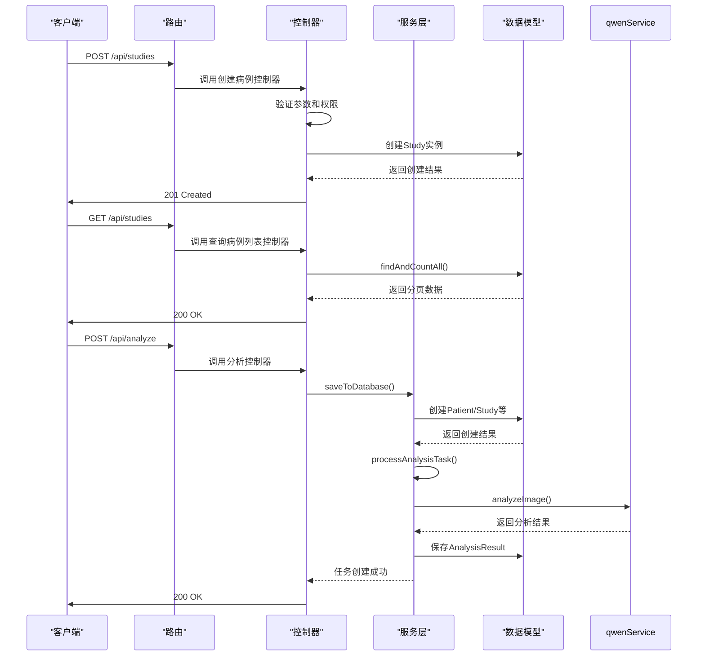
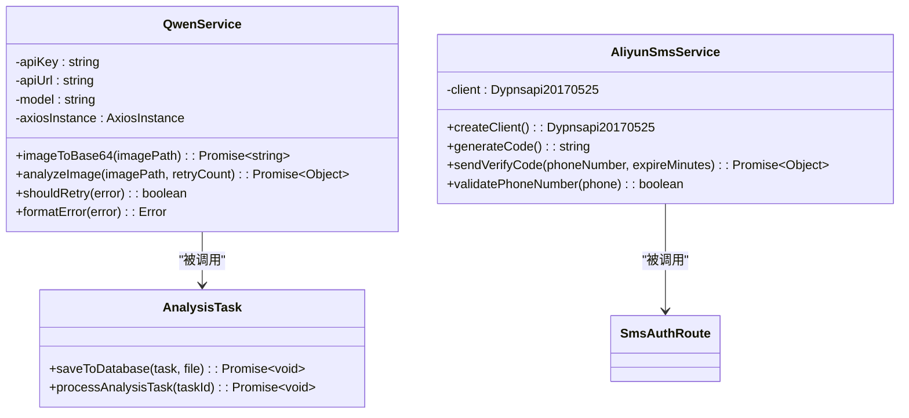
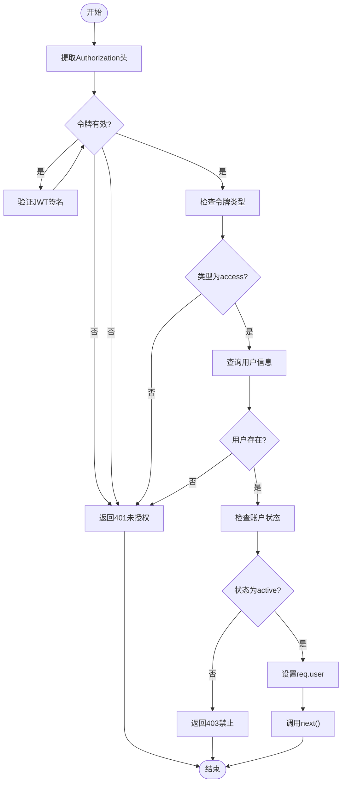
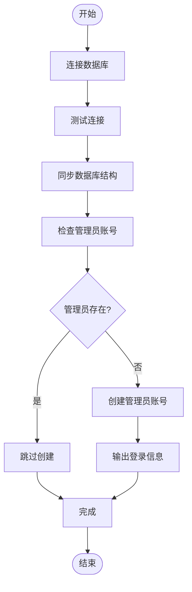
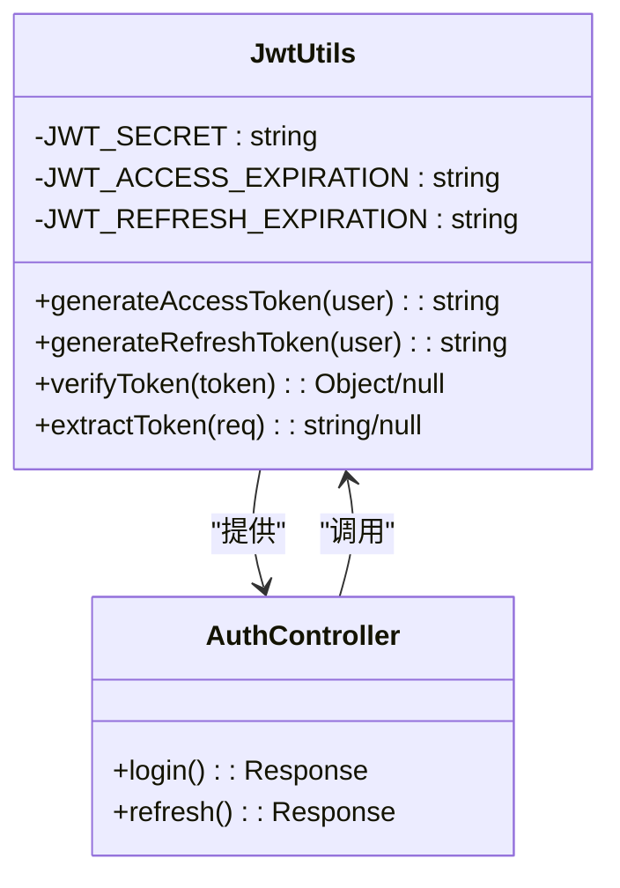

# 后端目录结构

> **本文档引用的文件**
> - [database.js](file://server/config/database.js)
> - [sequelize.js](file://server/config/sequelize.js)
> - [User.js](file://server/models/User.js)
> - [Study.js](file://server/models/Study.js)
> - [AnalysisTask.js](file://server/models/AnalysisTask.js)
> - [index.js](file://server/models/index.js)
> - [studies.js](file://server/routes/studies.js)
> - [analyze.js](file://server/routes/analyze.js)
> - [auth.js](file://server/middleware/auth.js)
> - [init-database.js](file://server/scripts/init-database.js)
> - [update-status.sql](file://server/scripts/update-status.sql)
> - [jwt.js](file://server/utils/jwt.js)
> - [qwenService.js](file://server/services/qwenService.js)
> - [sms.service.js](file://server/services/sms.service.js)

## 目录
1. [项目结构](#项目结构)
2. [数据库配置与ORM初始化](#数据库配置与orm初始化)
3. [数据模型定义与关系映射](#数据模型定义与关系映射)
4. [API路由与控制器设计](#api路由与控制器设计)
5. [业务逻辑封装](#业务逻辑封装)
6. [JWT认证中间件](#jwt认证中间件)
7. [数据库初始化脚本](#数据库初始化脚本)
8. [JWT工具函数](#jwt工具函数)

## 项目结构

宫颈癌检测AI系统的后端项目采用模块化设计，主要分为配置、中间件、模型、路由、脚本、服务和工具等目录。`config`目录存放数据库连接配置，`models`目录定义所有数据模型并建立关系，`routes`目录实现RESTful API接口，`services`目录封装核心业务逻辑，`middleware`目录提供认证授权功能，`scripts`目录包含数据库初始化和维护脚本，`utils`目录提供通用工具函数。

**Diagram sources**
- [server/config/database.js](file://server/config/database.js)
- [server/models/User.js](file://server/models/User.js)
- [server/routes/studies.js](file://server/routes/studies.js)
- [server/services/qwenService.js](file://server/services/qwenService.js)

## 数据库配置与ORM初始化

数据库配置通过`config/database.js`文件实现，采用Sequelize ORM框架连接MySQL数据库。配置文件区分开发和生产环境，定义了数据库连接参数、字符集、连接池设置和日志级别。`config/sequelize.js`文件负责初始化Sequelize实例，建立数据库连接，并提供测试连接和同步数据库结构的功能。

数据库配置包含用户名、密码、数据库名、主机、端口等信息，通过环境变量注入以确保安全性。连接池配置最大20个连接，最小5个连接，获取连接超时30秒。Sequelize实例启用软删除功能，通过`paranoid: true`选项实现记录的逻辑删除而非物理删除。

**Diagram sources**
- [server/config/database.js](file://server/config/database.js#L1-L62)
- [server/config/sequelize.js](file://server/config/sequelize.js#L1-L54)

**Section sources**
- [server/config/database.js](file://server/config/database.js#L1-L62)
- [server/config/sequelize.js](file://server/config/sequelize.js#L1-L54)

## 数据模型定义与关系映射

数据模型在`models`目录中定义，每个模型文件对应数据库中的一个表。通过Sequelize的`define`方法定义模型结构，包括字段类型、约束、索引和钩子函数。`models/index.js`文件集中导入所有模型并建立它们之间的关系。

核心模型包括`User`（用户）、`Study`（病例）、`AnalysisTask`（分析任务）等。`User`模型包含用户基本信息、角色和状态，使用bcrypt加密密码。`Study`模型表示医疗病例，包含检查类型、临床诊断等信息，并通过`beforeCreate`钩子自动生成唯一病例ID。`AnalysisTask`模型跟踪AI分析任务的状态和进度。

模型间的关系通过`hasMany`、`belongsTo`等方法建立。例如，一个用户可以创建多个病例，一个病例属于一个患者，一个分析任务关联一个病例和一个用户。这些关系映射确保了数据的一致性和完整性。

**Diagram sources**
- [server/models/User.js](file://server/models/User.js#L1-L109)
- [server/models/Study.js](file://server/models/Study.js#L1-L131)
- [server/models/AnalysisTask.js](file://server/models/AnalysisTask.js#L1-L109)
- [server/models/index.js](file://server/models/index.js#L1-L79)

**Section sources**
- [server/models/User.js](file://server/models/User.js#L1-L109)
- [server/models/Study.js](file://server/models/Study.js#L1-L131)
- [server/models/AnalysisTask.js](file://server/models/AnalysisTask.js#L1-L109)
- [server/models/index.js](file://server/models/index.js#L1-L79)

## API路由与控制器设计

API路由在`routes`目录中定义，采用Express框架实现RESTful接口。每个路由文件对应一个资源，如`studies.js`处理病例相关操作，`analyze.js`处理AI分析任务。路由通过HTTP方法（GET、POST、PUT、DELETE）绑定到相应的控制器函数。

`routes/studies.js`文件实现了病例的CRUD操作。创建病例时验证必填字段和用户权限，上传影像文件时使用multer中间件处理文件上传。查询病例列表支持分页、搜索和筛选功能，非管理员用户只能访问自己创建的病例。`routes/analyze.js`文件提供AI分析接口，接收图像文件并创建分析任务，支持异步处理和状态查询。

路由设计遵循REST原则，使用标准的HTTP状态码和JSON响应格式。每个API响应包含`success`标志、`message`描述和`data`数据体。错误处理统一捕获异常并返回500错误，同时记录详细的错误日志。

**Diagram sources**
- [server/routes/studies.js](file://server/routes/studies.js#L1-L530)
- [server/routes/analyze.js](file://server/routes/analyze.js#L1-L378)

**Section sources**
- [server/routes/studies.js](file://server/routes/studies.js#L1-L530)
- [server/routes/analyze.js](file://server/routes/analyze.js#L1-L378)

## 业务逻辑封装

业务逻辑在`services`目录中封装，主要包括`qwenService.js`调用通义千问API进行图像分析，以及`sms.service.js`发送短信验证码。服务层将复杂的业务逻辑从路由控制器中分离，提高代码的可维护性和复用性。

`qwenService.js`封装了与通义千问API的交互，包括图像转Base64编码、构建请求体、发送请求和解析响应。服务实现重试机制，对网络错误、超时和API限流等情况进行自动重试。响应解析包含JSON格式验证和必需字段检查，确保数据的完整性和可靠性。

`sms.service.js`封装阿里云短信服务，提供生成验证码、发送短信和验证手机号的功能。服务使用阿里云SDK调用短信API，处理API响应并提取业务ID。发送前验证手机号格式，发送后记录验证码到数据库以便后续验证。

**Diagram sources**
- [server/services/qwenService.js](file://server/services/qwenService.js#L1-L255)
- [server/services/sms.service.js](file://server/services/sms.service.js#L1-L128)
- [server/routes/analyze.js](file://server/routes/analyze.js#L1-L378)

**Section sources**
- [server/services/qwenService.js](file://server/services/qwenService.js#L1-L255)
- [server/services/sms.service.js](file://server/services/sms.service.js#L1-L128)

## JWT认证中间件

JWT认证在`middleware/auth.js`文件中实现，提供`authenticate`、`authorize`和`optionalAuth`三个中间件函数。`authenticate`中间件验证JWT令牌的有效性，解码后将用户信息附加到请求对象中。`authorize`中间件检查用户角色权限，确保只有授权用户才能访问特定资源。

认证流程包括：从请求头提取Bearer令牌，验证令牌签名和有效期，检查令牌类型为"access"，查询数据库获取用户信息并验证账户状态。成功认证后，将用户对象添加到`req.user`中供后续处理使用。权限控制基于用户角色（admin、doctor、user），通过`authorize('admin')`等方式限制访问。

**Diagram sources**
- [server/middleware/auth.js](file://server/middleware/auth.js#L1-L125)
- [server/utils/jwt.js](file://server/utils/jwt.js#L1-L69)

**Section sources**
- [server/middleware/auth.js](file://server/middleware/auth.js#L1-L125)

## 数据库初始化脚本

数据库初始化脚本在`scripts`目录中，包括`init-database.js`和SQL更新脚本。`init-database.js`脚本负责创建数据库结构、同步模型和创建默认管理员账户。脚本首先测试数据库连接，然后同步所有模型到数据库，最后检查并创建管理员账号。

`create-sms-table.js`脚本专门创建短信验证码表，确保`sms_codes`表存在。SQL脚本如`update-status.sql`用于直接执行数据库更新操作，将旧的"uploaded"状态更新为"pending"。`update-study-status.js`脚本使用原生MySQL连接执行状态更新，适用于批量数据迁移。

初始化脚本通过Node.js直接运行，无需通过应用服务器。脚本包含详细的日志输出，便于监控执行过程和排查问题。错误处理确保脚本在失败时退出并返回非零状态码。

**Diagram sources**
- [server/scripts/init-database.js](file://server/scripts/init-database.js#L1-L59)
- [server/scripts/update-status.sql](file://server/scripts/update-status.sql#L1-L7)

**Section sources**
- [server/scripts/init-database.js](file://server/scripts/init-database.js#L1-L59)
- [server/scripts/update-status.sql](file://server/scripts/update-status.sql#L1-L7)

## JWT工具函数

JWT工具函数在`utils/jwt.js`文件中实现，提供令牌生成、验证和提取功能。`generateAccessToken`和`generateRefreshToken`函数创建不同类型的JWT令牌，包含用户ID、用户名、角色等声明。访问令牌有效期较短（默认1小时），刷新令牌有效期较长（默认7天）。

`verifyToken`函数验证令牌的签名和有效期，返回解码后的负载或null。`extractToken`函数从HTTP请求头中提取Bearer令牌。工具函数使用环境变量配置密钥和过期时间，确保配置的灵活性和安全性。

JWT密钥通过`JWT_SECRET`环境变量设置，生产环境中必须使用强随机密钥。令牌类型通过`type`字段区分，防止令牌类型混淆攻击。生成的访问令牌包含用户基本信息，避免每次请求都查询数据库。

**Diagram sources**
- [server/utils/jwt.js](file://server/utils/jwt.js#L1-L69)
- [server/routes/auth.js](file://server/routes/auth.js#L1-L306)

**Section sources**
- [server/utils/jwt.js](file://server/utils/jwt.js#L1-L69)