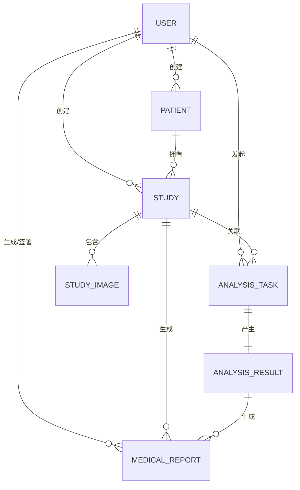
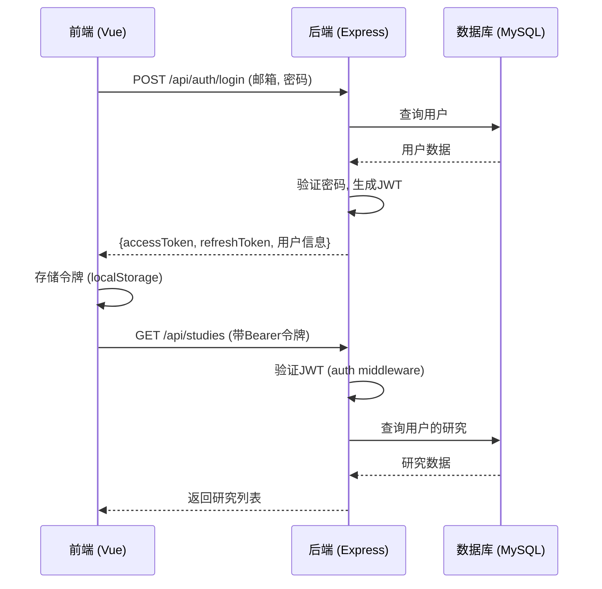
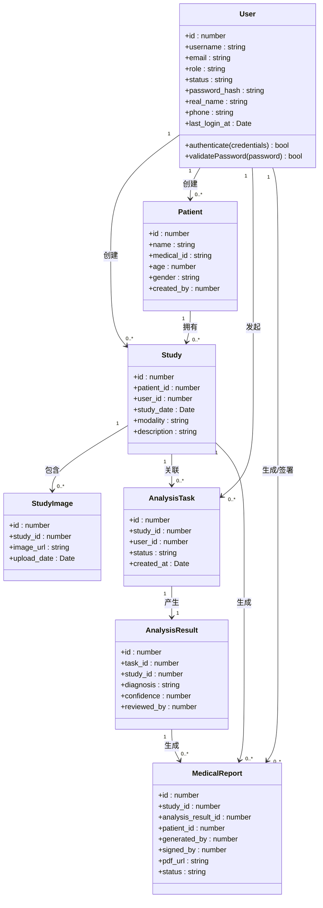
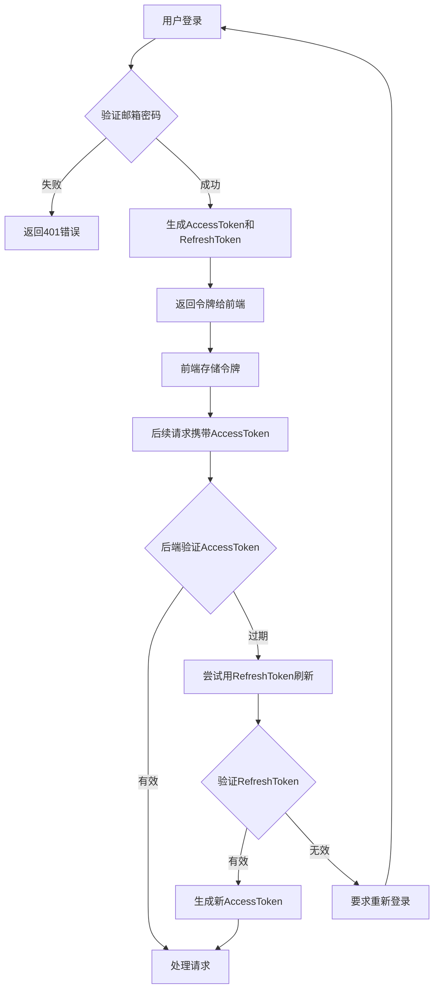
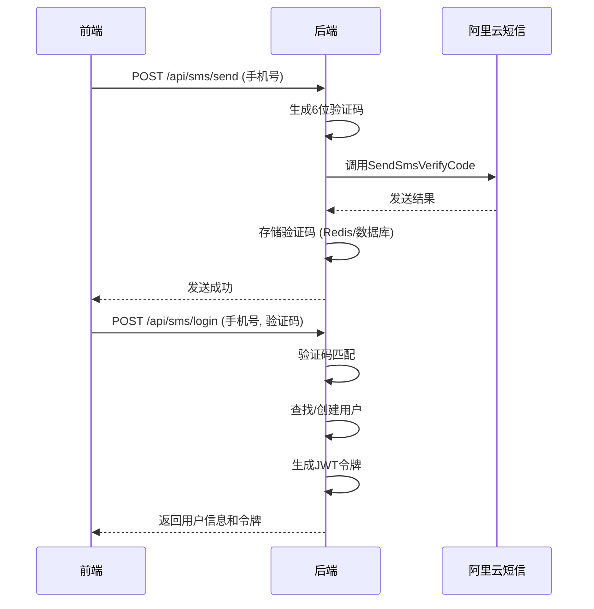

# 项目目录结构

<cite>
**本文档中引用的文件**  
- [database.js](file://server/config/database.js)
- [index.js](file://server/models/index.js)
- [auth.js](file://server/routes/auth.js)
- [routes.ts](file://src/router/routes.ts)
- [authStore.ts](file://src/stores/authStore.ts)
- [apiService.ts](file://src/services/apiService.ts)
- [.env](file://server/.env)
- [quasar.config.ts](file://quasar.config.ts)
- [tsconfig.json](file://tsconfig.json)
- [sms.service.js](file://server/services/sms.service.js)
- [jwt.js](file://server/utils/jwt.js)
</cite>

## 目录

1. [前端目录结构](#前端目录结构)
2. [后端目录结构](#后端目录结构)
3. [关键配置文件说明](#关键配置文件说明)
4. [前后端交互机制](#前后端交互机制)
5. [数据模型与关系](#数据模型与关系)
6. [认证与授权流程](#认证与授权流程)
7. [短信服务集成](#短信服务集成)

## 前端目录结构

前端代码位于 `src/` 目录下，采用 Quasar 框架（基于 Vue 3）构建，遵循模块化设计原则，便于维护和扩展。

### components
存放可复用的 UI 组件。当前仅包含 `EssentialLink.vue`，用于导航链接的封装，未来可扩展更多通用组件如按钮、表单控件等。

### layouts
定义页面布局模板。包含两个核心布局：
- `MainLayout.vue`：主应用布局，用于认证后的页面（如仪表盘、研究列表等），通常包含侧边栏、顶部导航栏。
- `PublicLayout.vue`：公共布局，用于登录、注册等未认证页面，结构更简洁。

### pages
存放具体页面组件，每个 `.vue` 文件对应一个路由页面。主要页面包括：
- `LoginPage.vue`、`RegisterPage.vue`：用户登录与注册
- `DashboardPage.vue`：用户仪表盘
- `StudiesPage.vue`、`StudyDetailPage.vue`：宫颈图像研究管理与详情
- `UploadPage.vue`：图像上传功能
- `ReportsPage.vue`：分析报告查看
- `ProfilePage.vue`、`SettingsPage.vue`：用户信息与设置
- `ErrorNotFound.vue`：404 错误页面

### router
路由配置目录，管理前端导航逻辑。
- `routes.ts`：定义所有路由规则，采用懒加载（`import()`）提升性能。包含公共路由（登录、注册）和受保护路由（需认证访问，通过 `meta: { requiresAuth: true }` 标记）。
- `index.ts`：创建并导出 Vue Router 实例。

### stores
使用 Pinia 管理全局状态，实现跨组件数据共享。
- `authStore.ts`：核心认证状态管理，存储用户信息、令牌、登录状态，并提供登录、注册、登出等方法。
- `studyStore.ts`、`analysisStore.ts`、`modelStore.ts`：分别管理研究数据、分析任务和模型配置的状态。
- `index.ts`：统一导出所有 store 模块。

### services
封装与后端 API 的交互逻辑。
- `api.ts`：定义 API 接口，组织不同模块的请求函数。
- `apiService.ts`：基于 Axios 的 HTTP 客户端封装，包含请求/响应拦截器、错误处理，并导出具体的业务请求方法（如 `uploadImage`、`getTaskStatus`）。
- `modelService.ts`：可能用于管理 AI 模型相关的 API 调用。

**Section sources**
- [routes.ts](file://src/router/routes.ts#L1-L72)
- [authStore.ts](file://src/stores/authStore.ts#L1-L219)
- [apiService.ts](file://src/services/apiService.ts#L1-L198)

## 后端目录结构

后端代码位于 `server/` 目录，采用 Node.js + Express 构建 RESTful API，结合 Sequelize ORM 操作 MySQL 数据库。

### config
存放配置文件。
- `database.js`：数据库连接配置，区分开发和生产环境，指定主机、端口、用户名、密码、数据库名及连接池参数。
- `sequelize.js`：Sequelize 实例化配置，建立与数据库的连接。

### middleware
存放中间件函数，用于请求处理流程的拦截和增强。
- `auth.js`：认证中间件，验证 JWT 令牌的有效性，确保受保护路由的安全访问。

### models
定义数据模型（Model），映射数据库表结构。
- 每个 `.js` 文件对应一个数据库表（如 `User.js`、`Patient.js`、`Study.js`）。
- `index.js`：集中导入所有模型，并定义它们之间的关联关系（如 `User.hasMany(Study)`），最后导出 Sequelize 实例和所有模型。

**Diagram sources**
- [index.js](file://server/models/index.js#L1-L79)
- [database.js](file://server/config/database.js#L1-L62)

**Section sources**
- [index.js](file://server/models/index.js#L1-L79)
- [database.js](file://server/config/database.js#L1-L62)

### routes
定义 API 路由，将 HTTP 请求映射到具体的处理函数。
- `auth.js`：用户认证相关接口（注册、登录、刷新令牌、获取用户信息）。
- `patients.js`、`studies.js`、`reports.js`：患者、研究、报告的 CRUD 操作。
- `analyze.js`：图像分析任务的创建与状态查询。
- `sms-auth.js`：短信验证码的发送与验证。
- 其他路由文件对应不同业务模块。

### services
封装业务逻辑，避免在路由处理函数中编写复杂代码。
- `sms.service.js`：阿里云短信服务的封装，负责生成验证码、发送短信。
- `qwenService.js`：通义千问大模型 API 的集成，可能用于生成分析报告。

### scripts
存放数据库相关的脚本文件。
- `init-database.js`：初始化数据库表结构。
- `create-sms-table.js`：创建短信验证码表。
- `update-status.sql`、`update-study-status.js`：用于批量更新数据状态的 SQL 脚本或 Node.js 脚本。

**Section sources**
- [auth.js](file://server/routes/auth.js#L1-L306)
- [sms.service.js](file://server/services/sms.service.js#L1-L128)

## 关键配置文件说明

### server/.env
后端环境变量文件，存储敏感信息和运行时配置。
- **数据库配置**：`DB_HOST`, `DB_PORT`, `DB_USER`, `DB_PASSWORD`, `DB_NAME`
- **JWT 配置**：`JWT_SECRET`（令牌密钥）、`JWT_ACCESS_EXPIRATION`（访问令牌有效期）、`JWT_REFRESH_EXPIRATION`（刷新令牌有效期）
- **短信服务**：`ALIYUN_ACCESS_KEY_ID`, `ALIYUN_ACCESS_KEY_SECRET`, `ALIYUN_SMS_SIGN_NAME`, `ALIYUN_SMS_TEMPLATE_CODE`
- **AI 模型**：`QWEN_API_KEY`, `QWEN_API_URL`, `QWEN_MODEL`
- **服务器**：`PORT`, `NODE_ENV`

**Section sources**
- [.env](file://server/.env#L1-L34)

### .env
前端环境变量文件（在 `src/env.d.ts` 中声明），通过 `import.meta.env` 访问。
- `VITE_API_BASE_URL`：后端 API 的基础 URL（如 `http://localhost:3000/api`），在 `apiService.ts` 中被引用。

**Section sources**
- [apiService.ts](file://src/services/apiService.ts#L3)
- [env.d.ts](file://src/env.d.ts#L1-L8)

### quasar.config.ts
Quasar 框架的核心配置文件。
- **构建配置**：指定目标浏览器、TypeScript 严格模式、Vue Router 模式（hash/history）。
- **插件配置**：启用 Notify 等 Quasar 插件。
- **开发服务器**：配置 `devServer.open = true`，启动时自动打开浏览器。
- **Vite 插件**：集成 `vite-plugin-checker` 进行类型检查和 ESLint。

**Section sources**
- [quasar.config.ts](file://quasar.config.ts#L1-L218)

### tsconfig.json
TypeScript 配置文件，继承自 Quasar 生成的配置。
- 通过 `extends: "./.quasar/tsconfig.json"` 继承框架的默认 TypeScript 配置，确保类型检查的一致性。

**Section sources**
- [tsconfig.json](file://tsconfig.json#L1-L4)

## 前后端交互机制

前端通过 Axios 与后端 API 进行通信，遵循 RESTful 设计原则。

**Diagram sources**
- [authStore.ts](file://src/stores/authStore.ts#L36-L63)
- [auth.js](file://server/routes/auth.js#L112-L188)
- [apiService.ts](file://src/services/apiService.ts#L6-L39)

**Section sources**
- [authStore.ts](file://src/stores/authStore.ts#L36-L63)
- [auth.js](file://server/routes/auth.js#L112-L188)
- [apiService.ts](file://src/services/apiService.ts#L6-L39)

## 数据模型与关系

系统围绕“用户-患者-研究-图像-分析-报告”这一核心业务流程构建数据模型。

**Diagram sources**
- [index.js](file://server/models/index.js#L1-L79)

**Section sources**
- [index.js](file://server/models/index.js#L1-L79)

## 认证与授权流程

系统采用 JWT（JSON Web Token）进行无状态认证。

**Diagram sources**
- [auth.js](file://server/routes/auth.js#L17-L250)
- [jwt.js](file://server/utils/jwt.js#L1-L69)
- [authStore.ts](file://src/stores/authStore.ts#L36-L63)

**Section sources**
- [auth.js](file://server/routes/auth.js#L17-L250)
- [jwt.js](file://server/utils/jwt.js#L1-L69)
- [authStore.ts](file://src/stores/authStore.ts#L36-L63)

## 短信服务集成

系统集成阿里云短信服务，支持手机号注册和登录。

**Diagram sources**
- [sms.service.js](file://server/services/sms.service.js#L1-L128)
- [auth.js](file://server/routes/auth.js) (隐含短信相关路由)

**Section sources**
- [sms.service.js](file://server/services/sms.service.js#L1-L128)